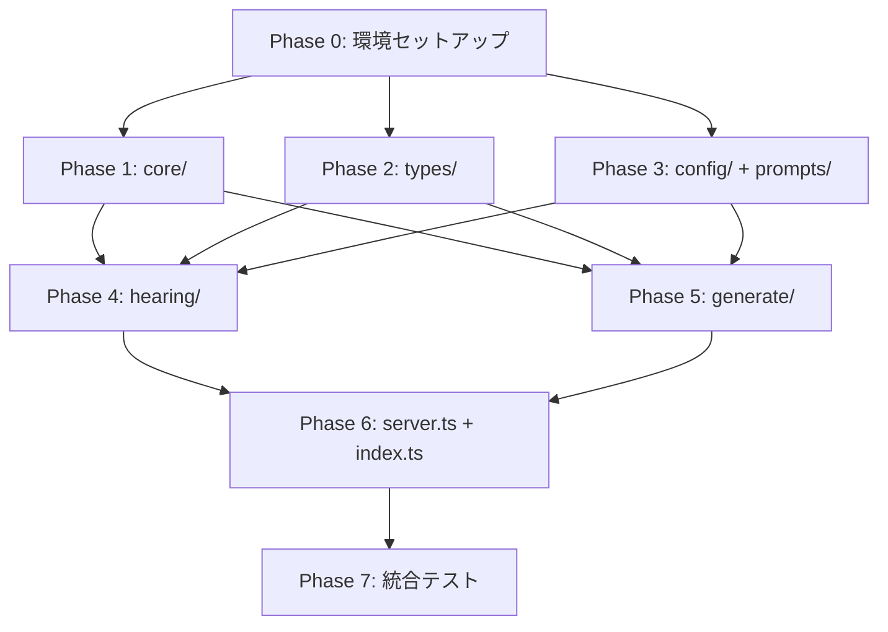

# 初回実装 設計書（Design）

## 1. 実装アプローチ

### 1.1 実装フェーズ

ボトムアップで依存関係の下層から順に実装する。各フェーズ完了時にビルド・テストが通る状態を維持する。

```
Phase 0: 環境セットアップ（Dev Container + プロジェクト初期化）
    ↓
Phase 1: 共通基盤（core/）
    ↓
Phase 2: 型定義（types/）
    ↓
Phase 3: 設定ファイル + プロンプトテンプレート（config/ + prompts/）
    ↓
Phase 4: ヒアリングモジュール（hearing/）
    ↓
Phase 5: アウトプット生成モジュール（generate/）
    ↓
Phase 6: サーバー + エントリポイント（server.ts + index.ts）
    ↓
Phase 7: 統合テスト（MCP Inspector + Claude Desktop）
```

### 1.2 各フェーズの依存関係



> Phase 1〜3 は相互に依存しないため並行実装可能だが、Phase 1（core/）を最初に実装すると他のモジュールのテストが書きやすくなる。

---

## 2. Phase 0: 環境セットアップ

### 2.1 Dev Container

#### devcontainer.json

```jsonc
{
  "name": "Galley MCP Server",
  "image": "mcr.microsoft.com/devcontainers/typescript-node:22",
  "postCreateCommand": "npm install -g @anthropic-ai/claude-code && npm install",
  "remoteEnv": {
    "ANTHROPIC_API_KEY": "${localEnv:ANTHROPIC_API_KEY}"
  },
  "customizations": {
    "vscode": {
      "extensions": [
        "dbaeumer.vscode-eslint",
        "esbenp.prettier-vscode",
        "bierner.markdown-mermaid"
      ],
      "settings": {
        "editor.defaultFormatter": "esbenp.prettier-vscode",
        "editor.formatOnSave": true,
        "editor.codeActionsOnSave": {
          "source.fixAll.eslint": "explicit"
        }
      }
    }
  }
}
```

**設計判断**:

| 判断 | 理由 |
|------|------|
| `image` で公式TypeScript-Nodeイメージを使用 | Dockerfileなしでシンプルに維持。Node.js 22 + TypeScript環境が同梱 |
| Claude Code は `postCreateCommand` で `npm install -g` | 公式のDev Container Featureが存在しないため、npmグローバルインストールで導入する |
| `remoteEnv` で `ANTHROPIC_API_KEY` を引き継ぐ | `containerEnv` ではなく `remoteEnv` + `localEnv` でホスト側の値を動的に参照。ホスト側で未設定の場合は空文字になるが、コンテナ起動は失敗しない |
| `postCreateCommand` で `npm install` も同時実行 | コンテナ作成時に自動で依存をインストール |

> **将来**: Anthropic が公式 Dev Container Feature を公開した場合、`features` フィールドに移行し、`postCreateCommand` から `npm install -g @anthropic-ai/claude-code` を削除する。

### 2.2 プロジェクト初期化

#### package.json

```json
{
  "name": "galley-mcp",
  "version": "0.1.0",
  "description": "MCP server for presales architecture design assistance",
  "type": "module",
  "bin": {
    "galley-mcp": "dist/index.js"
  },
  "files": [
    "dist/",
    "config/",
    "prompts/",
    "README.md",
    "LICENSE"
  ],
  "scripts": {
    "build": "tsup",
    "dev": "tsup --watch",
    "start": "node dist/index.js",
    "test": "vitest run",
    "test:watch": "vitest",
    "test:coverage": "vitest run --coverage",
    "lint": "eslint 'src/**/*.ts' 'tests/**/*.ts'",
    "format": "prettier --write 'src/**' 'tests/**'",
    "format:check": "prettier --check 'src/**' 'tests/**'",
    "typecheck": "tsc --noEmit",
    "inspect": "npx @modelcontextprotocol/inspector node dist/index.js",
    "check": "npm run typecheck && npm run lint && npm test && npm run build"
  },
  "engines": {
    "node": ">=22"
  },
  "dependencies": {
    "@modelcontextprotocol/sdk": "^1.12.0",
    "yaml": "^2.7.0",
    "zod": "^3.24.0"
  },
  "devDependencies": {
    "@eslint/js": "^9.18.0",
    "@types/node": "^22.10.0",
    "eslint": "^9.18.0",
    "eslint-config-prettier": "^10.0.0",
    "prettier": "^3.4.0",
    "tsup": "^8.3.0",
    "typescript": "^5.7.0",
    "typescript-eslint": "^8.20.0",
    "vitest": "^3.0.0",
    "@vitest/coverage-v8": "^3.0.0"
  }
}
```

> **バージョン方針**: メジャーバージョンは固定（`^` でマイナー・パッチの自動更新を許容）。`package-lock.json` で実際のバージョンをロックする。実装時に `npm install` で最新の互換バージョンを取得する。

#### tsconfig.json

```json
{
  "compilerOptions": {
    "strict": true,
    "noUncheckedIndexedAccess": true,
    "noImplicitReturns": true,
    "noFallthroughCasesInSwitch": true,
    "module": "Node16",
    "moduleResolution": "Node16",
    "target": "ES2022",
    "lib": ["ES2022"],
    "outDir": "dist",
    "rootDir": "src",
    "sourceMap": true,
    "esModuleInterop": true,
    "skipLibCheck": true,
    "forceConsistentCasingInFileNames": true,
    "resolveJsonModule": true,
    "isolatedModules": true
  },
  "include": ["src/**/*.ts"],
  "exclude": ["node_modules", "dist", "tests"]
}
```

> **`declaration` / `declarationMap` を含めない理由**: 本パッケージはCLIツールとして配布し、ライブラリとして公開APIを提供しないため不要。tsupの `dts: false` と整合する。

#### tsup.config.ts

```typescript
import { defineConfig } from 'tsup';

export default defineConfig({
  entry: ['src/index.ts'],
  format: ['esm'],
  target: 'node22',
  outDir: 'dist',
  clean: true,
  sourcemap: true,
  dts: false,
  banner: {
    js: '#!/usr/bin/env node',
  },
  external: [
    '@modelcontextprotocol/sdk',
    'yaml',
    'zod',
  ],
});
```

**設計判断**:

| 判断 | 理由 |
|------|------|
| `external` で主要依存を外部化 | npmパッケージとしてインストールされる前提。バンドルサイズ削減 |
| `banner` で shebang を挿入 | `npx galley-mcp` で直接実行できるようにする |
| `dts: false` | 型定義は公開API用ライブラリではないため不要。CLIツールとして配布 |
| `sourcemap: true` | 開発時のデバッグ用。npmパッケージの `files` には含めない |

#### vitest.config.ts

```typescript
import { defineConfig } from 'vitest/config';

export default defineConfig({
  test: {
    include: ['tests/**/*.test.ts'],
    coverage: {
      provider: 'v8',
      include: ['src/**/*.ts'],
      exclude: ['src/types/**', 'src/index.ts'],
    },
  },
});
```

#### .prettierrc

```json
{
  "semi": true,
  "singleQuote": true,
  "trailingComma": "all",
  "printWidth": 100,
  "tabWidth": 2
}
```

#### .vscode/extensions.json

```json
{
  "recommendations": [
    "dbaeumer.vscode-eslint",
    "esbenp.prettier-vscode",
    "bierner.markdown-mermaid"
  ]
}
```

#### .vscode/settings.json

```json
{
  "editor.defaultFormatter": "esbenp.prettier-vscode",
  "editor.formatOnSave": true,
  "editor.codeActionsOnSave": {
    "source.fixAll.eslint": "explicit"
  },
  "typescript.preferences.importModuleSpecifierEnding": "js"
}
```

---

## 3. Phase 1: 共通基盤（core/）

依存関係の上流から順に実装する: `errors` → `logger` → `storage` → `config` → `schema`

### 3.1 errors.ts

アプリケーション全体で使用するエラークラス、エラーコード、およびToolハンドラの共通エラーラッパーを定義する。

```typescript
import type { Logger } from './logger.js';

// --- エラーコード ---
export type GalleyErrorCode =
  | 'SESSION_NOT_FOUND'
  | 'INVALID_SESSION_STATUS'
  | 'VALIDATION_ERROR'
  | 'FILE_READ_ERROR'
  | 'FILE_WRITE_ERROR'
  | 'INVALID_FILENAME'
  | 'PATH_TRAVERSAL'
  | 'CONFIG_LOAD_ERROR';

// --- エラークラス ---
export class GalleyError extends Error {
  constructor(
    public readonly code: GalleyErrorCode,
    message: string,
    public readonly cause?: unknown,
  ) {
    super(message);
    this.name = 'GalleyError';
  }
}

// --- Toolハンドラ共通ラッパー ---
export function wrapToolHandler(
  handler: (args: unknown) => Promise<{ content: Array<{ type: string; text: string }> }>,
  logger: Logger,
) {
  return async (args: unknown) => {
    try {
      return await handler(args);
    } catch (error) {
      if (error instanceof GalleyError) {
        return {
          content: [{ type: 'text' as const, text: `Error [${error.code}]: ${error.message}` }],
          isError: true,
        };
      }
      logger.error('Unexpected error', error);
      return {
        content: [{ type: 'text' as const, text: 'Internal server error' }],
        isError: true,
      };
    }
  };
}
```

**`wrapToolHandler` を `core/errors.ts` に配置する理由**:

- hearing/tools.ts と generate/tools.ts の両方から使用される共通関数
- server.ts に配置すると循環依存（server.ts → hearing/ → server.ts）が発生する
- GalleyError のハンドリングと密結合しているため、errors.ts に同居が自然
- `Logger` は引数として受け取り、モジュール間の依存を最小化

### 3.2 logger.ts

stderr出力とMCP sendLoggingMessage の二重出力を抽象化する。

```typescript
import type { McpServer } from '@modelcontextprotocol/sdk/server/mcp.js';

export type LogLevel = 'debug' | 'info' | 'warning' | 'error';

export function createLogger(options: { level: LogLevel; server?: McpServer }): Logger;

export interface Logger {
  debug(message: string, data?: unknown): void;
  info(message: string, data?: unknown): void;
  warning(message: string, data?: unknown): void;
  error(message: string, data?: unknown): void;
  setServer(server: McpServer): void;
}
```

**実装方針**:

- ファクトリ関数 `createLogger` でインスタンスを生成
- `--log-level` に基づいてフィルタリング
- stderr出力: `console.error()` を使用
- MCP出力: `server` が設定されている場合のみ `server.sendLoggingMessage()` を呼ぶ
- サーバー初期化前はstderrのみ出力し、初期化後に `setServer()` でMCP出力を有効化

### 3.3 storage.ts

ファイルI/Oの抽象化レイヤー。アトミック書き込みとパストラバーサル防止を実装する。

```typescript
export interface StorageOptions {
  baseDir: string;  // ~/.galley
}

export function createStorage(options: StorageOptions): Storage;

export interface Storage {
  // ディレクトリ
  ensureDir(relativePath: string): Promise<void>;
  initDataDir(): Promise<void>;

  // JSON読み書き
  readJson<T>(relativePath: string): Promise<T>;
  writeJson(relativePath: string, data: unknown): Promise<void>;
  exists(relativePath: string): Promise<boolean>;

  // テキスト読み書き（Markdown、Mermaid、Terraform等）
  readText(relativePath: string): Promise<string>;
  writeText(relativePath: string, content: string): Promise<void>;

  // 一覧
  listDirs(relativePath: string): Promise<string[]>;

  // 削除
  removeDir(relativePath: string): Promise<void>;

  // パス検証
  validatePath(relativePath: string): string;
  validateFilename(filename: string): void;
}
```

**実装の要点**:

| 機能 | 実装方法 |
|------|---------|
| アトミック書き込み | `writeFile(tmpPath)` → `rename(tmpPath, targetPath)` |
| 一時ファイル名 | `{target}.tmp.{crypto.randomUUID().slice(0, 8)}` |
| パストラバーサル防止 | `path.resolve()` 後に `baseDir` のプレフィックスチェック |
| ファイル名バリデーション | `..`、`/`、`\` を含む名前を拒否 |
| ディレクトリ初期化 | `~/.galley/sessions/`、`~/.galley/output/` を初回作成（mode: `0o700`） |
| エラー変換 | Node.js の `ENOENT`、`EACCES` 等を `GalleyError` に変換 |

### 3.4 config.ts

設定ファイルの読み込み、3段階マージ、プロンプトテンプレート読み込み、テンプレート変数展開を管理する。

```typescript
import type { ZodSchema } from 'zod';

export interface ConfigLoaderOptions {
  defaultConfigDir: string;   // パッケージ同梱の config/
  userConfigDir?: string;     // ~/.galley/config/
  overrideConfigDir?: string; // --config-dir で指定
  promptsDir: string;         // パッケージ同梱の prompts/
}

export function createConfigLoader(options: ConfigLoaderOptions): ConfigLoader;

export interface ConfigLoader {
  loadConfig<T>(filename: string, schema: ZodSchema<T>): Promise<T>;
  loadPromptTemplate(filename: string): Promise<string>;
  getResolvedConfigDir(): string;
}

// --- テンプレート変数展開（hearing/prompts.ts, generate/prompts.ts から共用）---
export function renderTemplate(template: string, variables: Record<string, string>): string {
  return Object.entries(variables).reduce(
    (result, [key, value]) => result.replaceAll(`{{${key}}}`, value),
    template,
  );
}
```

**`renderTemplate` を `core/config.ts` に配置する理由**:

- hearing/prompts.ts と generate/prompts.ts の両方から使用される共通関数
- プロンプトテンプレートの読み込み（`loadPromptTemplate`）と変数展開は密接に関連する
- ステートレスな純粋関数であり、ConfigLoader のメソッドではなくモジュールレベルのエクスポートとして提供

**マージ戦略**:

```
1. overrideConfigDir（--config-dir）にファイルが存在すれば、それを使用
2. なければ userConfigDir（~/.galley/config/）を確認
3. なければ defaultConfigDir（パッケージ同梱 config/）を使用
```

- ファイル単位の上書き（ディープマージは行わない）
- YAML読み込みには `yaml` パッケージを使用
- 読み込んだ設定はZodスキーマでバリデーション

**パス解決**:

```typescript
import { fileURLToPath } from 'node:url';
import path from 'node:path';

const __filename = fileURLToPath(import.meta.url);
const __dirname = path.dirname(__filename);

// dist/index.js → パッケージルート → config/, prompts/
// ビルド後は dist/ 配下に1ファイルにバンドルされるため、1階層上がルート
const PACKAGE_ROOT = path.resolve(__dirname, '..');
const DEFAULT_CONFIG_DIR = path.join(PACKAGE_ROOT, 'config');
const DEFAULT_PROMPTS_DIR = path.join(PACKAGE_ROOT, 'prompts');
```

> この定数定義は `config.ts` ではなく `index.ts`（エントリポイント）に配置し、`ConfigLoaderOptions` として渡す。ビルド後のディレクトリ構造に依存するコードをエントリポイントに集約するため。

### 3.5 schema.ts

Zodスキーマの集約定義。データモデルの各型に対応するスキーマを定義する。

```typescript
import { z } from 'zod';

// ===== データモデルスキーマ =====

// --- AnsweredItem ---
export const EstimationSchema = z.object({
  confidence_label: z.enum(['public_reference', 'general_estimate']),
  reasoning: z.string(),
  source_info: z.string().optional(),
});

export const AnsweredItemSchema = z.object({
  value: z.union([z.string(), z.number(), z.boolean()]),
  source: z.enum(['user_selected', 'user_free_text', 'estimated', 'not_answered']),
  estimation: EstimationSchema.optional(),
});

// --- Session ---
export const SessionSchema = z.object({
  session_id: z.string().uuid(),
  created_at: z.string().datetime(),
  updated_at: z.string().datetime(),
  status: z.enum(['in_progress', 'completed']),
  project_description: z.string(),
});

// --- HearingResult ---
export const HearingResultSchema = z.object({
  metadata: z.object({
    hearing_id: z.string().uuid(),
    created_at: z.string().datetime(),
    updated_at: z.string().datetime().optional(),
    version: z.literal('1.0.0'),
    status: z.enum(['in_progress', 'completed']),
  }),
  project_overview: z.object({
    description: z.string(),
    industry: AnsweredItemSchema.optional(),
    project_type: AnsweredItemSchema.optional(),
  }),
  requirements: z.object({
    scale: z.object({
      concurrent_users: AnsweredItemSchema.optional(),
      total_users: AnsweredItemSchema.optional(),
    }).optional(),
    traffic: z.object({
      spike_pattern: AnsweredItemSchema.optional(),
      peak_tps: AnsweredItemSchema.optional(),
    }).optional(),
    database: z.object({
      existing_db: AnsweredItemSchema.optional(),
      migration_required: AnsweredItemSchema.optional(),
      data_volume: AnsweredItemSchema.optional(),
    }).optional(),
    network: z.object({
      multi_region: AnsweredItemSchema.optional(),
      on_premises_connection: AnsweredItemSchema.optional(),
    }).optional(),
    security: z.object({
      auth_method: AnsweredItemSchema.optional(),
      compliance: AnsweredItemSchema.optional(),
    }).optional(),
    availability: z.object({
      sla_target: AnsweredItemSchema.optional(),
      dr_requirement: AnsweredItemSchema.optional(),
      backup_policy: AnsweredItemSchema.optional(),
    }).optional(),
    performance: z.object({
      latency_requirement: AnsweredItemSchema.optional(),
      throughput_requirement: AnsweredItemSchema.optional(),
    }).optional(),
    operations: z.object({
      monitoring: AnsweredItemSchema.optional(),
      log_retention: AnsweredItemSchema.optional(),
    }).optional(),
    budget_schedule: z.object({
      cost_constraint: AnsweredItemSchema.optional(),
      demo_deadline: AnsweredItemSchema.optional(),
    }).optional(),
  }),
});

// --- ArchitectureOutput ---
export const ComponentSchema = z.object({
  category: z.string(),
  service_name: z.string(),
  purpose: z.string(),
  reason: z.string(),
});

export const WarningSchema = z.object({
  type: z.string(),
  message: z.string(),
  severity: z.enum(['error', 'warning', 'info']),
});

export const ArchitectureOutputSchema = z.object({
  session_id: z.string().uuid(),
  components: z.array(ComponentSchema),
  decisions: z.array(z.object({
    category: z.string(),
    decision: z.string(),
    reason: z.string(),
  })),
  warnings: z.array(WarningSchema),
});

// ===== Tool引数スキーマ =====

export const CreateSessionArgsSchema = z.object({
  project_description: z.string().min(1).max(5000),
});

export const SaveAnswerArgsSchema = z.object({
  session_id: z.string().uuid(),
  question_id: z.string(),
  category: z.string(),
  value: z.union([z.string(), z.number(), z.boolean()]),
  source: z.enum(['user_selected', 'user_free_text', 'estimated', 'not_answered']),
  estimation: EstimationSchema.optional(),
});

export const SaveAnswersBatchArgsSchema = z.object({
  session_id: z.string().uuid(),
  answers: z.array(SaveAnswerArgsSchema.omit({ session_id: true })),
});

export const SessionIdArgsSchema = z.object({
  session_id: z.string().uuid(),
});

export const ListSessionsArgsSchema = z.object({
  status: z.enum(['in_progress', 'completed']).optional(),
});

export const SaveArchitectureArgsSchema = z.object({
  session_id: z.string().uuid(),
  components: z.array(ComponentSchema),
  decisions: z.array(z.object({
    category: z.string(),
    decision: z.string(),
    reason: z.string(),
  })),
  warnings: z.array(WarningSchema).optional().default([]),
});

export const ExportMermaidArgsSchema = z.object({
  session_id: z.string().uuid(),
  mermaid_code: z.string().min(1),
});

export const ExportIacArgsSchema = z.object({
  session_id: z.string().uuid(),
  files: z.array(z.object({
    name: z.string(),
    content: z.string(),
  })).min(1),
});

export const ExportAllArgsSchema = z.object({
  session_id: z.string().uuid(),
  mermaid_code: z.string().optional(),
  iac_files: z.array(z.object({
    name: z.string(),
    content: z.string(),
  })).optional(),
});

// ===== 設定ファイルスキーマ =====

export const HearingQuestionsConfigSchema = z.object({
  version: z.string(),
  categories: z.array(z.object({
    id: z.string(),
    label: z.string(),
    required: z.boolean().optional().default(true),
    description: z.string().optional(),
  })),
});

export const HearingFlowConfigSchema = z.object({
  version: z.string(),
  default_order: z.array(z.string()),
  conditional_rules: z.array(z.object({
    condition: z.string(),
    add_categories: z.array(z.string()).optional(),
    skip_categories: z.array(z.string()).optional(),
  })).optional().default([]),
});

export const OciServicesConfigSchema = z.object({
  version: z.string(),
  services: z.array(z.object({
    name: z.string(),
    category: z.string(),
    description: z.string(),
    use_cases: z.array(z.string()).optional(),
    constraints: z.array(z.string()).optional(),
  })),
});

export const OciArchitecturesConfigSchema = z.object({
  version: z.string(),
  patterns: z.array(z.object({
    id: z.string(),
    name: z.string(),
    description: z.string(),
    components: z.array(z.string()),
    applicable_industries: z.array(z.string()).optional(),
  })),
});

export const OciTerraformConfigSchema = z.object({
  version: z.string(),
  resources: z.array(z.object({
    resource_type: z.string(),
    description: z.string(),
    example: z.string(),
  })),
});
```

**設計判断**:

| 判断 | 理由 |
|------|------|
| 全スキーマを `schema.ts` に集約 | スキーマと型の一元管理。`types/` との分離は後述 |
| `requirements` の各フィールドを `optional()` | ヒアリング途中のデータも保存可能にするため |
| Tool引数スキーマもここに配置 | バリデーションロジックとスキーマ定義を分離しない |
| 設定ファイルスキーマ5種すべてを定義 | 全YAMLファイルの読み込み時バリデーションを保証 |
| `ExportAllArgsSchema` に `mermaid_code` / `iac_files` をオプション引数として含む | Tool呼び出し削減の目的を達成するための本設計（後述 7.2 参照） |

---

## 4. Phase 2: 型定義（types/）

Zodスキーマから `z.infer` で型を導出する。

### 4.1 types/hearing.ts

```typescript
import type { z } from 'zod';
import type {
  AnsweredItemSchema,
  EstimationSchema,
  HearingResultSchema,
} from '../core/schema.js';

export type Estimation = z.infer<typeof EstimationSchema>;
export type AnsweredItem = z.infer<typeof AnsweredItemSchema>;
export type HearingResult = z.infer<typeof HearingResultSchema>;
export type ConfidenceLabel = Estimation['confidence_label'];
export type AnswerSource = AnsweredItem['source'];
```

### 4.2 types/session.ts

```typescript
import type { z } from 'zod';
import type { SessionSchema } from '../core/schema.js';

export type Session = z.infer<typeof SessionSchema>;
export type SessionStatus = Session['status'];

// セッション一覧用のサマリー型（スキーマ導出ではなく手動定義）
export interface SessionSummary {
  session_id: string;
  project_description: string;
  status: SessionStatus;
  created_at: string;
  updated_at: string;
}
```

### 4.3 types/architecture.ts

```typescript
import type { z } from 'zod';
import type {
  ArchitectureOutputSchema,
  ComponentSchema,
  WarningSchema,
} from '../core/schema.js';

export type ArchitectureOutput = z.infer<typeof ArchitectureOutputSchema>;
export type Component = z.infer<typeof ComponentSchema>;
export type Warning = z.infer<typeof WarningSchema>;
```

### 4.4 types/index.ts

```typescript
export type {
  Estimation,
  AnsweredItem,
  HearingResult,
  ConfidenceLabel,
  AnswerSource,
} from './hearing.js';

export type {
  Session,
  SessionStatus,
  SessionSummary,
} from './session.js';

export type {
  ArchitectureOutput,
  Component,
  Warning,
} from './architecture.js';
```

---

## 5. Phase 3: 設定ファイル + プロンプトテンプレート

### 5.1 config/hearing-questions.yaml

10カテゴリの質問定義。AIクライアント（LLM）が実際の選択肢を動的生成するための骨格を提供する。

```yaml
version: "1.0.0"
categories:
  - id: project_overview
    label: 案件概要
    required: true
    description: 業種、案件の種類（新規構築/移行/モダナイゼーション）

  - id: scale
    label: 規模
    required: true
    description: 想定ユーザー数、同時接続数

  - id: traffic
    label: トラフィック特性
    required: true
    description: スパイクの有無・予測可能性

  - id: database
    label: データベース
    required: true
    description: 既存DB、移行要件、データ量

  - id: network
    label: ネットワーク
    required: true
    description: マルチリージョン、オンプレ接続、VPN/専用線

  - id: security
    label: セキュリティ・認証
    required: true
    description: 認証方式、コンプライアンス要件

  - id: availability
    label: 可用性・DR
    required: true
    description: SLA目標、DR要件、バックアップ方針

  - id: performance
    label: パフォーマンス
    required: false
    description: レイテンシ要件、スループット要件（規模に依存）

  - id: operations
    label: 運用・監視
    required: false
    description: ログ管理、監視要件、ログ保持期間

  - id: budget_schedule
    label: 予算・スケジュール
    required: true
    description: コスト制約、デモ期限
```

### 5.2 config/hearing-flow.yaml

ヒアリングの進行順序と条件分岐ルールを定義する。

```yaml
version: "1.0.0"
default_order:
  - project_overview
  - scale
  - traffic
  - database
  - network
  - security
  - availability
  - performance
  - operations
  - budget_schedule

conditional_rules:
  - condition: "scale.concurrent_users > 10000"
    add_categories:
      - performance
  - condition: "network.multi_region == true"
    add_categories:
      - availability
```

> **注意**: `conditional_rules` はAIクライアント（LLM）がテンプレートとして参照し、自身の判断で質問の追加・スキップを行う。MCPサーバーが条件を評価するのではない。

### 5.3 config/oci-services.yaml

OCI主要20サービスのカタログ。サイズ < 8 KB。

```yaml
version: "1.0.0"
services:
  - name: Compute
    category: コンピュート
    description: 仮想マシンインスタンス
    use_cases:
      - Webサーバー
      - アプリケーションサーバー
    constraints:
      - Flexシェイプ推奨（コスト最適化）
    # ... 省略（全20サービス分を実装時に記述）
```

### 5.4 config/oci-architectures.yaml

業種・ユースケース別のリファレンスアーキテクチャパターン。サイズ < 5 KB。

```yaml
version: "1.0.0"
patterns:
  - id: web_three_tier
    name: Web三層アーキテクチャ
    description: フロントエンド + アプリケーション + データベースの基本構成
    components:
      - Load Balancer
      - Compute (OKE or VM)
      - Autonomous Database
    applicable_industries:
      - 小売・EC
      - 製造業
    # ... 省略
```

### 5.5 config/oci-terraform.yaml

OCI Terraform Providerの主要リソース定義名と基本例。サイズ < 5 KB。

```yaml
version: "1.0.0"
resources:
  - resource_type: oci_core_vcn
    description: Virtual Cloud Network
    example: |
      resource "oci_core_vcn" "main" {
        compartment_id = var.compartment_id
        cidr_blocks    = ["10.0.0.0/16"]
        display_name   = "galley-vcn"
      }
  # ... 省略
```

### 5.6 config/hearing-result-schema.json

`galley://schemas/hearing-result` Resourceとして提供するJSON Schemaの静的ファイル。

```
config/
├── hearing-questions.yaml
├── hearing-flow.yaml
├── hearing-result-schema.json    ... HearingResult の JSON Schema（静的ファイル）
├── oci-services.yaml
├── oci-architectures.yaml
└── oci-terraform.yaml
```

- 機能設計書（functional-design.md §3.1）に記載のJSON Schemaをそのまま配置する
- `zod-to-json-schema` の依存を避ける。依存最小化の方針
- AIクライアントがヒアリング結果の構造を理解するために使用するリファレンス用途
- Zodスキーマ（`schema.ts`）の方がランタイムバリデーションの正（canonical source）。JSON Schemaはあくまでクライアント向けの参考情報

### 5.7 prompts/start-hearing.md

機能設計書（functional-design.md §4.1）に記載のプロンプトをベースに、テンプレート変数を使用する。

- テンプレート変数: `{{project_description}}`
- 内容: ヒアリングアシスタントの役割定義、進行ルール、出力形式

### 5.8 prompts/resume-hearing.md

- テンプレート変数: `{{session_id}}`
- 内容: 中断セッションの再開手順。`get_hearing_result` で現状を取得し、未回答カテゴリから質問を再開

### 5.9 prompts/generate-architecture.md

機能設計書（functional-design.md §4.2）に記載のプロンプトをベースに実装する。

- テンプレート変数: `{{session_id}}`
- 内容: アーキテクチャ設計ルール、出力形式、アンチパターン検出

---

## 6. Phase 4: ヒアリングモジュール（hearing/）

### 6.1 hearing/resources.ts

Resources の登録を担当する。

```typescript
export function registerHearingResources(
  server: McpServer,
  configLoader: ConfigLoader,
  storage: Storage,
): void;
```

**登録するResources**:

| URI | 実装方法 |
|-----|---------|
| `galley://templates/hearing-questions` | `configLoader.loadConfig('hearing-questions.yaml', schema)` を呼び、JSON文字列として返す |
| `galley://templates/hearing-flow` | 同上（`hearing-flow.yaml`） |
| `galley://schemas/hearing-result` | `configLoader.loadPromptTemplate('../config/hearing-result-schema.json')` で静的JSONを読み込み返す（※パス解決は `config/` ディレクトリから） |
| `galley://sessions` | `storage.listDirs('sessions')` でセッション一覧を取得し、各セッションのメタデータを返す |
| `galley://sessions/{session_id}` | リソーステンプレート。`storage.readJson('sessions/{id}/session.json')` + `hearing-result.json` の内容を返す |

**設計判断**:

| 判断 | 理由 |
|------|------|
| テンプレートResourceは初回読み込みでメモリキャッシュ | 設定ファイルは不変。再読み込みは不要 |
| セッション一覧は毎回ファイルシステムを読む | セッションは動的に増減するためキャッシュしない |
| JSON Schemaは `config/` 内の静的ファイルとして管理 | `zod-to-json-schema` の依存を避ける。依存最小化の方針 |

> **`galley://schemas/hearing-result` の読み込み**: `configLoader` にJSON読み込み用のメソッドを追加するか、`loadConfig` をJSON対応にするかは実装時に判断する。シンプルな実装としては `storage.readText` でファイル内容をそのまま返す方法もある。

### 6.2 hearing/tools.ts

Tool ハンドラの実装。すべてのハンドラは `core/errors.ts` の `wrapToolHandler` でラップする。

```typescript
import { wrapToolHandler } from '../core/errors.js';

export function registerHearingTools(
  server: McpServer,
  storage: Storage,
  logger: Logger,
): void;
```

**各Toolの実装概要**:

#### create_session

```
入力: { project_description: string }
処理:
  1. CreateSessionArgsSchema でバリデーション
  2. session_id = crypto.randomUUID()
  3. session.json を作成（status: "in_progress"）
  4. hearing-result.json を初期状態で作成
  5. server.sendResourcesListChanged() でセッション一覧更新を通知
出力: { session_id, created_at }
```

#### save_answer

```
入力: { session_id, question_id, category, value, source, estimation? }
処理:
  1. SaveAnswerArgsSchema でバリデーション
  2. session.json を読み込み、status が "in_progress" であることを確認
  3. hearing-result.json を読み込み
  4. category に対応する requirements フィールドに AnsweredItem を追加・更新
  5. hearing-result.json をアトミック書き込み
  6. session.json の updated_at を更新
出力: { saved: true, question_id, category }
```

**category → requirements フィールドのマッピング**:

```typescript
const CATEGORY_FIELD_MAP: Record<string, string[]> = {
  project_overview: ['project_overview'],
  scale: ['requirements', 'scale'],
  traffic: ['requirements', 'traffic'],
  database: ['requirements', 'database'],
  network: ['requirements', 'network'],
  security: ['requirements', 'security'],
  availability: ['requirements', 'availability'],
  performance: ['requirements', 'performance'],
  operations: ['requirements', 'operations'],
  budget_schedule: ['requirements', 'budget_schedule'],
};
```

> `question_id` はカテゴリ内の具体的なフィールド名（`concurrent_users`、`spike_pattern` 等）に対応する。`category` + `question_id` でネストされたフィールドを特定する。

#### save_answers_batch

```
入力: { session_id, answers: Array<{ question_id, category, value, source, estimation? }> }
処理:
  1. SaveAnswersBatchArgsSchema でバリデーション
  2. session.json の status 確認
  3. hearing-result.json を1回読み込み
  4. 全回答をループで適用
  5. hearing-result.json を1回のアトミック書き込みで保存
出力: { saved: true, count: answers.length }
```

#### complete_hearing

```
入力: { session_id }
処理:
  1. session.json を読み込み、status が "in_progress" であることを確認
     （既に "completed" の場合は INVALID_SESSION_STATUS エラー）
  2. hearing-result.json の metadata.status を "completed" に更新
  3. session.json の status を "completed" に更新
  4. 両ファイルをアトミック書き込み
出力: { session_id, status: "completed", summary: {...} }
  summary には回答済み/未回答のカテゴリ数を含む
```

#### get_hearing_result

```
入力: { session_id }
処理:
  1. hearing-result.json を読み込み
  2. HearingResultSchema でバリデーション
出力: HearingResult JSON
```

#### list_sessions

```
入力: { status?: string }
処理:
  1. storage.listDirs('sessions') でセッションディレクトリ一覧を取得
  2. 各ディレクトリの session.json を読み込み
  3. status フィルタリング（指定時）
  4. created_at の降順でソート
出力: SessionSummary[] の配列
```

#### delete_session

```
入力: { session_id }
処理:
  1. セッションディレクトリの存在確認
  2. sessions/{session_id}/ と output/{session_id}/ を削除
  3. server.sendResourcesListChanged()
出力: { deleted: true, session_id }
```

### 6.3 hearing/prompts.ts

Prompt の登録を担当する。

```typescript
import { renderTemplate } from '../core/config.js';

export function registerHearingPrompts(
  server: McpServer,
  configLoader: ConfigLoader,
): void;
```

**実装方法**:

1. `configLoader.loadPromptTemplate('start-hearing.md')` でテンプレートを読み込み
2. MCP Prompt として登録（`arguments` に `project_description` を定義）
3. Prompt 呼び出し時に `renderTemplate()` で `{{project_description}}` を置換してクライアントに返す

---

## 7. Phase 5: アウトプット生成モジュール（generate/）

### 7.1 generate/resources.ts

```typescript
export function registerGenerateResources(
  server: McpServer,
  configLoader: ConfigLoader,
): void;
```

**登録するResources**:

| URI | 実装方法 | バリデーションスキーマ |
|-----|---------|---------------------|
| `galley://references/oci-services` | `configLoader.loadConfig('oci-services.yaml', OciServicesConfigSchema)` → JSON文字列 | `OciServicesConfigSchema` |
| `galley://references/oci-architectures` | 同上（`oci-architectures.yaml`） | `OciArchitecturesConfigSchema` |
| `galley://references/oci-terraform` | 同上（`oci-terraform.yaml`） | `OciTerraformConfigSchema` |

- テンプレートResourceと同様に初回読み込みでメモリキャッシュする

### 7.2 generate/tools.ts

```typescript
import { wrapToolHandler } from '../core/errors.js';

export function registerGenerateTools(
  server: McpServer,
  storage: Storage,
  logger: Logger,
): void;
```

**各Toolの実装概要**:

#### save_architecture

```
入力: { session_id, components[], decisions[], warnings[] }
処理:
  1. SaveArchitectureArgsSchema でバリデーション
  2. セッションの存在確認
  3. architecture.json をアトミック書き込み
出力: { saved: true, session_id, component_count }
```

#### export_summary

```
入力: { session_id }
処理:
  1. hearing-result.json を読み込み
  2. architecture.json を読み込み（存在する場合）
  3. Markdownテンプレートに基づいて要件サマリーを生成
     - 確定事項（source: user_selected / user_free_text）→ ✅
     - 推測（source: estimated）→ 🔶（根拠・信頼度ラベル付き）
     - 未確認（source: not_answered）→ ⚠️
  4. output/{session_id}/summary.md にアトミック書き込み
出力: { file_path: "output/{session_id}/summary.md" }
```

> **ファイルパスの返却**: 絶対パスではなく `data-dir` からの相対パスを返す。

#### export_mermaid

```
入力: { session_id, mermaid_code }
処理:
  1. ExportMermaidArgsSchema でバリデーション
  2. output/{session_id}/architecture.mmd にアトミック書き込み
出力: { file_path: "output/{session_id}/architecture.mmd" }
```

> **`mermaid_code` をTool引数で受け取る理由**: Mermaidコードの生成はAIクライアント（LLM）が行う。MCPサーバーはファイル書き出しのみを担当する。

#### export_iac

```
入力: { session_id, files: [{ name, content }] }
処理:
  1. ExportIacArgsSchema でバリデーション
  2. 各ファイルの name に対して validateFilename() でチェック
  3. output/{session_id}/terraform/{name} にアトミック書き込み
出力: { file_paths: ["output/{session_id}/terraform/main.tf", ...] }
```

#### export_all

```
入力: { session_id, mermaid_code?, iac_files? }
処理:
  1. ExportAllArgsSchema でバリデーション
  2. セッションの存在確認（hearing-result.json が存在すること）
  3. export_summary を実行 → summary.md を出力
  4. mermaid_code が指定されていれば export_mermaid を実行 → architecture.mmd を出力
  5. iac_files が指定されていれば export_iac を実行 → terraform/*.tf を出力
出力: { output_dir: "output/{session_id}/", files: [...] }
```

**設計判断**:

`export_all` は「1回のTool呼び出しで全出力を完了する」ためのバッチ操作。`mermaid_code` と `iac_files` をオプション引数として受け取ることで、LLMは以下のフローでTool呼び出しを最小化できる。

```
1. create_session           (1回)
2. save_answers_batch       (2〜3回)
3. complete_hearing          (1回)
4. get_hearing_result        (1回)
5. save_architecture         (1回)
6. export_all(mermaid + iac) (1回)  ← summary + 構成図 + IaC を一括出力
合計: 7〜9回
```

- `mermaid_code` / `iac_files` が省略された場合は summary.md のみ出力する
- 個別に `export_mermaid` / `export_iac` を呼ぶことも引き続き可能（柔軟性を維持）

### 7.3 generate/prompts.ts

```typescript
import { renderTemplate } from '../core/config.js';

export function registerGeneratePrompts(
  server: McpServer,
  configLoader: ConfigLoader,
): void;
```

- `generate-architecture.md` を読み込み、`{{session_id}}` を引数で置換
- Prompt呼び出し時に `renderTemplate()` で展開

---

## 8. Phase 6: サーバー + エントリポイント

### 8.1 server.ts

MCPサーバーの初期化と各モジュールの登録を担当する。

```typescript
import { McpServer } from '@modelcontextprotocol/sdk/server/mcp.js';

export interface ServerDependencies {
  storage: Storage;
  configLoader: ConfigLoader;
  logger: Logger;
}

export function createGalleyServer(deps: ServerDependencies): McpServer {
  const server = new McpServer(
    { name: 'galley', version: '0.1.0' },
    {
      capabilities: {
        resources: { listChanged: true },
        tools: {},
        prompts: {},
        logging: {},
      },
    },
  );

  // 各モジュールの登録
  registerHearingResources(server, deps.configLoader, deps.storage);
  registerHearingTools(server, deps.storage, deps.logger);
  registerHearingPrompts(server, deps.configLoader);

  registerGenerateResources(server, deps.configLoader);
  registerGenerateTools(server, deps.storage, deps.logger);
  registerGeneratePrompts(server, deps.configLoader);

  return server;
}
```

**設計判断**:

| 判断 | 理由 |
|------|------|
| 依存性注入パターン | テスト時にStorage/Logger等をモック化しやすい |
| `McpServer` クラスを使用 | MCP SDK v1の高レベルAPI。Resources/Tools/Prompts の登録がシンプル |
| 各モジュールの登録関数を呼び出す | モジュール間の結合は server.ts のみで行い、hearing/generate は互いを知らない |

> **MCP SDK API の確認事項**: `McpServer` コンストラクタの引数（serverInfo, options）の正確なシグネチャは SDK バージョンにより異なる可能性がある。実装前に `node_modules/@modelcontextprotocol/sdk` の型定義を確認すること。

### 8.2 index.ts

CLI引数のパース、依存オブジェクトの初期化、MCPサーバーの起動を担当する。

```typescript
#!/usr/bin/env node

import os from 'node:os';
import path from 'node:path';
import { fileURLToPath } from 'node:url';
import { parseArgs } from 'node:util';
import { StdioServerTransport } from '@modelcontextprotocol/sdk/server/stdio.js';
import { createLogger } from './core/logger.js';
import { createStorage } from './core/storage.js';
import { createConfigLoader } from './core/config.js';
import { createGalleyServer } from './server.js';
import type { LogLevel } from './core/logger.js';

// パス解決
const __filename = fileURLToPath(import.meta.url);
const __dirname = path.dirname(__filename);
const PACKAGE_ROOT = path.resolve(__dirname, '..');

async function main(): Promise<void> {
  // 1. CLI引数パース
  const { values } = parseArgs({
    options: {
      'data-dir': { type: 'string', default: path.join(os.homedir(), '.galley') },
      'config-dir': { type: 'string' },
      'log-level': { type: 'string', default: 'info' },
    },
  });

  // 2. 依存オブジェクトの初期化
  const logger = createLogger({ level: values['log-level'] as LogLevel });
  const storage = createStorage({ baseDir: values['data-dir']! });
  await storage.initDataDir();

  const configLoader = createConfigLoader({
    defaultConfigDir: path.join(PACKAGE_ROOT, 'config'),
    userConfigDir: path.join(values['data-dir']!, 'config'),
    overrideConfigDir: values['config-dir'],
    promptsDir: path.join(PACKAGE_ROOT, 'prompts'),
  });

  // 3. MCPサーバーの初期化
  const server = createGalleyServer({ storage, configLoader, logger });
  logger.setServer(server);

  // 4. stdioトランスポートで起動
  const transport = new StdioServerTransport();
  await server.connect(transport);

  logger.info('Galley MCP server started');
}

main().catch((error) => {
  console.error('Failed to start Galley MCP server:', error);
  process.exit(1);
});
```

**`node:util` の `parseArgs`**:

Node.js 18.3+ に標準搭載されたCLI引数パーサー。外部パッケージ（`commander`、`yargs`等）を使わずに引数を処理する。依存最小化の方針に合致。

---

## 9. テスト方針

### 9.1 テスト対象と優先順位

| 優先度 | テスト対象 | テストファイル | 主要テストケース |
|--------|-----------|--------------|----------------|
| 高 | `core/storage.ts` | `tests/core/storage.test.ts` | アトミック書き込み、パストラバーサル防止、ディレクトリ初期化 |
| 高 | `core/schema.ts` | `tests/core/schema.test.ts` | 各Zodスキーマの正常系・異常系バリデーション |
| 高 | `core/config.ts` | `tests/core/config.test.ts` | 3段階マージ、不正YAML、ファイル不在、renderTemplate |
| 中 | `core/errors.ts` | `tests/core/errors.test.ts` | GalleyError生成、wrapToolHandler（正常系・GalleyError・予期しないエラー） |
| 中 | `hearing/tools.ts` | `tests/hearing/tools.test.ts` | 各Toolの正常系・異常系（Storageモック） |
| 中 | `generate/tools.ts` | `tests/generate/tools.test.ts` | 各Toolの正常系・異常系（Storageモック） |
| 低 | `hearing/resources.ts` | `tests/hearing/resources.test.ts` | Resource取得、セッション一覧 |
| 低 | `generate/resources.ts` | `tests/generate/resources.test.ts` | Resource取得 |

### 9.2 テストフィクスチャ

```
tests/fixtures/
├── sessions/
│   └── test-session/
│       ├── session.json               ... 正常なセッションデータ
│       ├── hearing-result.json        ... ヒアリング途中のデータ
│       ├── hearing-result-complete.json ... ヒアリング完了データ
│       └── architecture.json          ... アーキテクチャデータ
├── config/
│   ├── hearing-questions.yaml         ... テスト用の質問テンプレート
│   ├── hearing-flow.yaml              ... テスト用のフロー定義
│   └── invalid.yaml                   ... 不正YAML（異常系テスト用）
└── invalid/
    ├── traversal-paths.json           ... パストラバーサルテストケース
    └── malformed-session.json         ... スキーマ不正のセッションデータ
```

### 9.3 core/storage.test.ts の特殊性

`storage.test.ts` は実際のファイルシステムを使用する（他のテストはStorageをモック化）。

- テスト用の一時ディレクトリを `beforeEach` で作成
- テスト完了後に `afterEach` でクリーンアップ
- `os.tmpdir()` 配下に作成することで安全性を確保

---

## 10. 影響範囲の分析

### 10.1 新規作成ファイル一覧

| ディレクトリ | ファイル | 概要 |
|------------|---------|------|
| `.devcontainer/` | `devcontainer.json` | Dev Container定義 |
| `.vscode/` | `extensions.json`, `settings.json` | VS Code設定 |
| ルート | `package.json`, `tsconfig.json`, `tsup.config.ts`, `vitest.config.ts`, `eslint.config.js`, `.prettierrc`, `.gitignore` | プロジェクト設定 |
| `src/core/` | `errors.ts`, `logger.ts`, `storage.ts`, `config.ts`, `schema.ts` | 共通基盤（5ファイル） |
| `src/types/` | `hearing.ts`, `session.ts`, `architecture.ts`, `index.ts` | 型定義（4ファイル） |
| `src/hearing/` | `resources.ts`, `tools.ts`, `prompts.ts` | ヒアリングモジュール（3ファイル） |
| `src/generate/` | `resources.ts`, `tools.ts`, `prompts.ts` | 生成モジュール（3ファイル） |
| `src/` | `server.ts`, `index.ts` | サーバー + エントリポイント（2ファイル） |
| `config/` | 5つのYAMLファイル + 1つのJSONファイル | デフォルト設定（6ファイル） |
| `prompts/` | 3つのMDファイル | プロンプトテンプレート（3ファイル） |
| `tests/` | テストファイル + フィクスチャ | テスト一式 |

**合計**: 約 42 ファイル

### 10.2 永続的ドキュメントへの影響

初回実装では `docs/` 内の永続的ドキュメントへの変更は基本的に不要。ただし、実装中に設計上の判断変更があった場合は適宜更新する。

- `repository-structure.md`: Dev Container追加済み（今回の requirements.md 作成時に反映済み）
- `development-guidelines.md`: `wrapToolHandler` の配置先が `server.ts または hearing/tools.ts` と記載されているが、実際は `core/errors.ts` に配置する。実装時にコメントとして注記するが、development-guidelines.md 自体の更新は初回実装完了後にまとめて行う
- その他: 変更なし

### 10.3 リスクと対策

| リスク | 影響 | 対策 |
|-------|------|------|
| MCP SDK v1 の API差異 | `McpServer` コンストラクタやメソッドのシグネチャが想定と異なる可能性 | 実装開始前に `node_modules/@modelcontextprotocol/sdk` の型定義ファイルを確認。必要に応じて設計を調整 |
| YAML設定ファイルのサイズ超過 | トークン消費が想定を超える | 実装中にサイズを計測し、超過時はサービスを絞り込む |
| Claude Code CLIのインストール方法変更 | `@anthropic-ai/claude-code` のパッケージ名やインストール手段が変わる可能性 | 実装時に公式ドキュメントを確認。Dev Containerの `postCreateCommand` を修正 |
| `parseArgs` の制限 | 複雑なオプション構文（例: `--data-dir=path`）への対応 | Node.js 22では `--data-dir=value` と `--data-dir value` の両方をサポート。問題なし |
