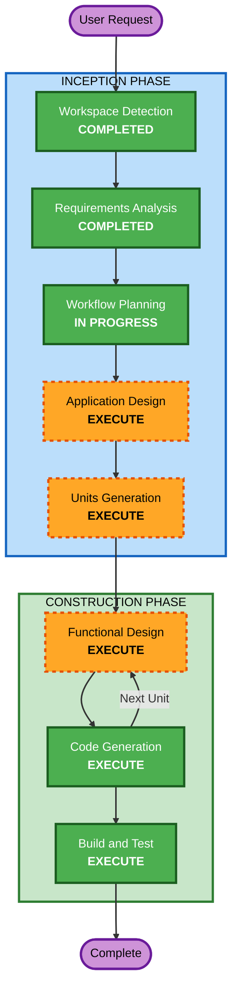

# Execution Plan

## Detailed Analysis Summary

### Change Impact Assessment
- **User-facing changes**: Yes - プリセールスエンジニアが自然言語でデモ環境を構築する新しいワークフロー
- **Structural changes**: Yes - Claude Code Skills/Workflows + OCI Resource Manager連携の新規アーキテクチャ
- **Data model changes**: No - 永続データモデルなし（都度生成・都度破棄）
- **API changes**: N/A - 新規プロジェクト
- **NFR impact**: Low - 社内ツールのため最小限

### Risk Assessment
- **Risk Level**: Medium
  - Claude Code Skills/Workflowsの仕様理解が必要（DC-3）
  - メタ開発による自己参照リスク（DC-4）
  - OCI Resource Manager APIの正確な操作が必要
- **Rollback Complexity**: Easy（新規プロジェクト、既存システムへの影響なし）
- **Testing Complexity**: Complex（Skill/Workflow統合テストにClaude Code実行が必要）

## Workflow Visualization



### Text Alternative
```
Phase 1: INCEPTION
  - Workspace Detection (COMPLETED)
  - Requirements Analysis (COMPLETED)
  - User Stories (SKIP)
  - Workflow Planning (IN PROGRESS)
  - Application Design (EXECUTE)
  - Units Generation (EXECUTE)

Phase 2: CONSTRUCTION (per unit)
  - Functional Design (EXECUTE)
  - NFR Requirements (SKIP)
  - NFR Design (SKIP)
  - Infrastructure Design (SKIP)
  - Code Generation (EXECUTE)
  - Build and Test (EXECUTE)

Phase 3: OPERATIONS
  - Operations (PLACEHOLDER)
```

## Phases to Execute

### INCEPTION PHASE
- [x] Workspace Detection (COMPLETED)
- [x] Requirements Analysis (COMPLETED)
- [ ] User Stories - **SKIP**
  - **Rationale**: ユーザーストーリーはユーザー自身が十分に説明済み（プリセールスエンジニアのデモ環境構築）。対象ユーザーが単一ペルソナのため追加のストーリー分析は不要。
- [x] Workflow Planning (IN PROGRESS)
- [ ] Application Design - **EXECUTE**
  - **Rationale**: 新規プロジェクトでSkills/Workflowsの構成、コンポーネント設計、メタ開発戦略の定義が必要。特にClaude Code Skills/Workflowsのファイル構成とPythonコアロジックの関係を設計する必要がある。
- [ ] Units Generation - **EXECUTE**
  - **Rationale**: ワークフローが複数の独立したフェーズ（Hearing、Terraform生成、App生成、Deploy、Verification）に分かれており、ユニット分割が必要。並行実行の設計も含む。

### CONSTRUCTION PHASE (per unit)
- [ ] Functional Design - **EXECUTE**
  - **Rationale**: 各ユニットのビジネスロジック（ヒアリング質問生成、Terraform生成ルール、E2Eテスト戦略等）の詳細設計が必要。
- [ ] NFR Requirements - **SKIP**
  - **Rationale**: 社内ツールのため特別なNFR要件なし。パフォーマンス・セキュリティはOCI基盤に依存。
- [ ] NFR Design - **SKIP**
  - **Rationale**: NFR Requirementsがスキップのため。
- [ ] Infrastructure Design - **SKIP**
  - **Rationale**: ツール自体のインフラは既存のインスタンスプリンシパル認証済みOCIインスタンスを使用。ツールが生成するインフラはFunctional Designで扱う。
- [ ] Code Generation - **EXECUTE** (ALWAYS)
  - **Rationale**: 各ユニットのSkill/Workflow/Pythonコードの実装。
- [ ] Build and Test - **EXECUTE** (ALWAYS)
  - **Rationale**: Pythonユニットテスト、Skill/Workflow統合テスト手順の策定。

### OPERATIONS PHASE
- [ ] Operations - PLACEHOLDER

## Success Criteria
- **Primary Goal**: プリセールスエンジニアが自然言語でOCI上にデモ環境を構築できるClaude Code Skills/Workflowsの完成
- **Key Deliverables**:
  - Claude Code Skills（ヒアリング、Terraform生成、OCI CLI操作、デプロイ、E2Eテスト）
  - Claude Code Workflow（全フェーズの自律的オーケストレーション）
  - Pythonコアロジック（質問生成、Terraform生成、テスト実行）
  - 開発者向けドキュメント（メタ開発手順、テスト方法）
- **Quality Gates**:
  - Pythonコアロジックの単体テスト通過
  - 個別Skillの動作確認
  - Workflow全体の統合テスト（サンプルシナリオでのE2E実行）
