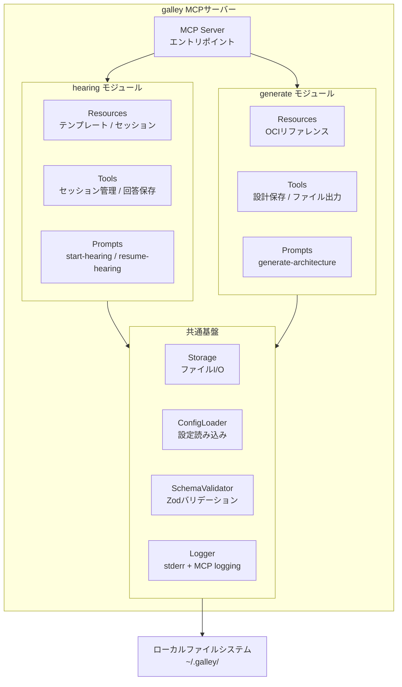
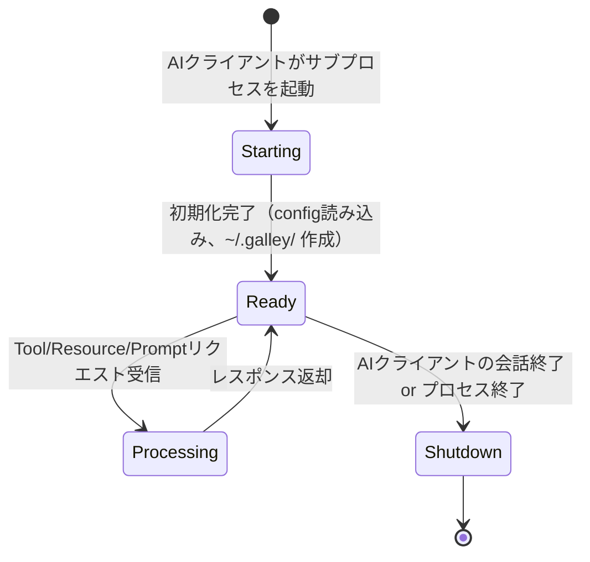

# 技術仕様書（Architecture Document）

## 1. テクノロジースタック

### 1.1 概要

| レイヤー | 技術 | 備考 |
|---------|------|------|
| ランタイム | Node.js >= 22 | LTS版（2027年4月までサポート） |
| 言語 | TypeScript 5.x | 厳密な型チェック（strict mode） |
| MCPフレームワーク | @modelcontextprotocol/sdk ^1.x | MCP公式TypeScript SDK（v2は安定リリース後に移行検討） |
| スキーマバリデーション | Zod | ランタイムでのJSON入出力バリデーション |
| テスト | Vitest | 高速なユニットテスト |
| ビルド | tsup | TypeScriptのバンドル・トランスパイル |
| パッケージ管理 | npm | npx実行対応 |
| リンター | ESLint + Prettier | コード品質・フォーマット統一 |
| 設定ファイル | YAML | 質問テンプレート・OCIリファレンス等 |

### 1.2 主要な依存パッケージ

| パッケージ | 用途 | 備考 |
|-----------|------|------|
| `@modelcontextprotocol/sdk` | MCPサーバーの実装基盤 | npm: [@modelcontextprotocol/sdk](https://www.npmjs.com/package/@modelcontextprotocol/sdk) |
| `zod` | リクエスト/レスポンスのスキーマ定義とバリデーション | |
| `uuid` | セッションID生成（v4） | `crypto.randomUUID()` で代替可能なら削除 |
| `yaml` | YAML設定ファイルの読み込み | |

> **依存最小化の方針**: `date-fns` 等の日時ライブラリは使用しない。ISO 8601フォーマットは `Date.toISOString()` で対応する。

### 1.3 技術選定の理由

| 選定項目 | 選定理由 |
|---------|---------|
| TypeScript | MCP SDKの第一級サポート。型安全性によりJSONスキーマとの整合を保証 |
| Zod | TypeScriptの型とランタイムバリデーションを統一的に管理。MCP SDKとの相性が良い |
| YAML（設定ファイル） | 質問テンプレート等の人間が編集するファイルはYAMLの可読性が有利。JSONスキーマ定義はJSONのまま保持 |
| tsup | esbuildベースで高速ビルド。CLIツールのバンドルに適している |
| Vitest | TypeScriptネイティブ対応。設定が少なく高速 |

### 1.4 MCP SDK バージョン方針

- 現時点ではv1系（^1.x）を使用する
- v2はモノレポ化（`@modelcontextprotocol/server` 等への分割）が予定されているが、安定版リリースを待ってから移行を検討する
- `package-lock.json` でバージョンを固定し、SDK更新は明示的に行う

---

## 2. システムアーキテクチャ

### 2.1 MCPサーバー構成

MVP段階では単一のMCPサーバー（`galley`）として実装する。機能設計書で定義した galley-hearing と galley-generate の責務は、内部モジュールとして分離する。

> **設計判断**: 2つの独立したMCPサーバーに分けると、AIクライアントの設定が2つ必要になりユーザーの導入障壁が上がる。単一サーバーとしつつ、内部構造を明確に分離することで、将来の分割にも対応できるようにする。



### 2.2 通信方式

MCPサーバーはstdio（標準入出力）トランスポートで動作する。AIクライアントがサブプロセスとしてMCPサーバーを起動し、JSON-RPCメッセージをstdioで交換する。

```
AIクライアント  <--stdout/stdin (JSON-RPC)--> galley MCPサーバー <--ファイルI/O--> ~/.galley/
                                                  |
                                                  +--> stderr（デバッグログ）
```

- ネットワーク通信は発生しない（ローカル完結）
- stdoutはJSON-RPCプロトコル専用。**`console.log()` は使用禁止**（プロトコルを破壊する）
- デバッグログは `console.error()`（stderr）に出力する
- AIクライアント向けの構造化ログは `server.sendLoggingMessage()` を使用する

### 2.3 プロセスライフサイクル



- AIクライアントがチャットセッション（会話）を開始するたびにMCPサーバープロセスが起動する
- 会話が終了するとプロセスも終了する
- **セッションデータはファイルに永続化されているため、次回起動時に前回のデータを参照可能**
- ファイル書き込み中のプロセス終了に備え、書き込みはアトミック操作（一時ファイルに書き込み→リネーム）で行う

### 2.4 起動オプション

MCPサーバーは以下のコマンドライン引数を受け付ける。

| オプション | デフォルト | 説明 |
|-----------|----------|------|
| `--data-dir` | `~/.galley` | データディレクトリのパス |
| `--config-dir` | （パッケージ内蔵） | 設定ファイルディレクトリ。指定時はデフォルト設定を上書き |
| `--log-level` | `info` | ログレベル（debug / info / warning / error） |

### 2.5 AIクライアント設定例（Claude Desktop）

```json
{
  "mcpServers": {
    "galley": {
      "command": "npx",
      "args": ["-y", "galley-mcp"]
    }
  }
}
```

データディレクトリを変更する場合:
```json
{
  "mcpServers": {
    "galley": {
      "command": "npx",
      "args": ["-y", "galley-mcp", "--data-dir", "/path/to/custom/dir"]
    }
  }
}
```

> **パッケージ名**: npm公開時のスコープ・名称は開発時に決定する。ここでは仮に `galley-mcp` とする。

### 2.6 MCPケーパビリティ宣言

サーバー初期化時に以下のケーパビリティをクライアントに宣言する。

```typescript
{
  capabilities: {
    resources: {
      listChanged: true   // セッション追加・削除時にリスト変更を通知
    },
    tools: {},
    prompts: {},
    logging: {}           // 構造化ログの送信
  }
}
```

- `listChanged: true` により、`create_session` / `delete_session` 実行後に `notifications/resources/list_changed` を送信し、セッション一覧Resourceの更新をAIクライアントに通知する

---

## 3. ディレクトリ構造

### 3.1 ソースコード

```
galley/
├── src/
│   ├── index.ts                    ... エントリポイント（CLI引数パース、MCPサーバー起動）
│   ├── server.ts                   ... MCPサーバー定義（Resources/Tools/Prompts登録）
│   │
│   ├── hearing/                    ... ヒアリングモジュール
│   │   ├── resources.ts            ... Resources登録（テンプレート、セッション）
│   │   ├── tools.ts                ... Tools登録（セッション管理、回答保存）
│   │   └── prompts.ts              ... Prompts登録（.mdファイルを読み込んでMCP Promptsとして登録）
│   │
│   ├── generate/                   ... アウトプット生成モジュール
│   │   ├── resources.ts            ... Resources登録（OCIリファレンス）
│   │   ├── tools.ts                ... Tools登録（設計保存、ファイル出力）
│   │   └── prompts.ts              ... Prompts登録（.mdファイルを読み込んでMCP Promptsとして登録）
│   │
│   ├── core/                       ... 共通基盤
│   │   ├── storage.ts              ... ファイルI/O（アトミック書き込み、パス検証）
│   │   ├── config.ts               ... 設定ファイル読み込み（デフォルト + ユーザー設定のマージ）
│   │   ├── schema.ts               ... Zodスキーマ定義・バリデーション
│   │   ├── logger.ts               ... ログ出力（stderr + MCP sendLoggingMessage）
│   │   └── errors.ts               ... エラー定義
│   │
│   └── types/                      ... 共有型定義
│       ├── hearing.ts              ... HearingResult, Answer, AnsweredItem 等
│       ├── session.ts              ... Session, SessionIndex 等
│       ├── architecture.ts         ... ArchitectureOutput, Component, Decision 等
│       └── index.ts                ... re-export
│
├── config/                         ... デフォルト設定ファイル（パッケージに同梱）
│   ├── hearing-questions.yaml      ... 質問カテゴリテンプレート
│   ├── hearing-flow.yaml           ... ヒアリングフロー進行ルール
│   └── oci-services.yaml           ... OCIサービスカタログ（主要サービスに限定）
│
├── prompts/                        ... プロンプトテンプレート（.mdファイル）
│   ├── start-hearing.md            ... ヒアリング開始プロンプト
│   ├── resume-hearing.md           ... ヒアリング再開プロンプト
│   └── generate-architecture.md    ... アーキテクチャ生成プロンプト
│
├── tests/
│   ├── hearing/
│   │   ├── tools.test.ts
│   │   └── resources.test.ts
│   ├── generate/
│   │   ├── tools.test.ts
│   │   └── resources.test.ts
│   └── core/
│       ├── storage.test.ts
│       ├── schema.test.ts
│       └── config.test.ts
│
├── package.json
├── tsconfig.json
├── tsup.config.ts
├── vitest.config.ts
├── .eslintrc.cjs
├── .prettierrc
└── .gitignore
```

### 3.2 `src/**/*.ts` と外部ファイルの関係

```
src/hearing/prompts.ts  ──読み込み──>  prompts/start-hearing.md
                                       prompts/resume-hearing.md

src/hearing/resources.ts ──読み込み──>  config/hearing-questions.yaml
                                       config/hearing-flow.yaml

src/generate/resources.ts ──読み込み──> config/oci-services.yaml
src/generate/prompts.ts  ──読み込み──>  prompts/generate-architecture.md
```

各モジュールの `prompts.ts` は外部Markdownファイルを読み込み、テンプレート変数を置換した上でMCP Promptsとして登録する。プロンプト内容の変更はコード修正なしで `.md` ファイルの編集だけで可能。

### 3.3 型定義の配置ルール

| 配置先 | 対象 |
|-------|------|
| `src/types/` | 複数モジュールから参照されるドメイン型（HearingResult, Session, ArchitectureOutput等） |
| `src/hearing/` 内ローカル | hearingモジュール内でのみ使う内部型（Tool引数のスキーマ等） |
| `src/generate/` 内ローカル | generateモジュール内でのみ使う内部型 |
| `src/core/` 内ローカル | 基盤モジュール内でのみ使う内部型（StorageOptions等） |

### 3.4 設定ファイルの優先順位

```
1. コマンドライン引数（--config-dir で指定したディレクトリ内のファイル）
   ↓ 上書き
2. ユーザー設定（~/.galley/config/ 内のファイル — ユーザーが手動配置）
   ↓ 上書き
3. デフォルト設定（パッケージ同梱の config/ ディレクトリ）
```

マージ戦略: ファイル単位で上書き（フィールド単位のディープマージは行わない）。設定をカスタマイズする場合は、デフォルト設定ファイルをコピーして編集する。

---

## 4. 開発ツールと手法

### 4.1 開発環境

| ツール | 用途 | 備考 |
|-------|------|------|
| VS Code | 推奨エディタ | |
| Node.js 22 | ランタイム | LTS版 |
| npm | パッケージ管理 | |
| MCP Inspector | MCPサーバーのデバッグ | `npx @modelcontextprotocol/inspector` で起動 |
| Claude Desktop | 統合テスト用AIクライアント | |

### 4.2 開発ワークフロー

```
コード修正 → ビルド → ユニットテスト → MCP Inspectorで動作確認 → Claude Desktopで統合テスト
```

### 4.3 テスト戦略

#### ユニットテスト（Vitest）

| テスト対象 | テスト内容 |
|-----------|-----------|
| `core/storage.ts` | ファイル読み書き、アトミック書き込み、パストラバーサル防止、存在しないファイルのエラー |
| `core/schema.ts` | Zodスキーマによるバリデーション（正常系・異常系） |
| `core/config.ts` | 設定ファイル読み込み、優先順位マージ、不正YAMLのエラー |
| `hearing/tools.ts` | create_session / save_answer / complete_hearing の入出力（Storageをモック） |
| `generate/tools.ts` | save_architecture / export_* の入出力（Storageをモック） |

#### 統合テスト（MCP Inspector）

MCP Inspectorを使い、実際のMCPプロトコルでResources/Tools/Promptsの動作を確認する。

- Resources: テンプレートが正しいフォーマットで返されるか
- Tools: セッション作成→回答保存→完了→結果取得のフロー
- Prompts: テンプレート変数が正しく展開されるか

#### E2Eテスト（手動）

Claude Desktopで実際にヒアリング→アーキテクチャ生成のフローを通す。自動化はMVP段階では行わない。

### 4.4 npmスクリプト

```json
{
  "scripts": {
    "build": "tsup",
    "dev": "tsup --watch",
    "start": "node dist/index.js",
    "test": "vitest run",
    "test:watch": "vitest",
    "lint": "eslint src/",
    "format": "prettier --write src/",
    "typecheck": "tsc --noEmit",
    "inspect": "npx @modelcontextprotocol/inspector node dist/index.js"
  }
}
```

### 4.5 CI/CD（将来）

MVP段階ではローカル開発のみ。チーム展開段階で以下を導入予定。

- GitHub Actionsによるテスト・リント自動実行
- npm publishの自動化
- セマンティックバージョニング

---

## 5. 技術的制約と要件

### 5.1 MCPプロトコルの制約

| 制約 | 影響 | 対応 |
|------|------|------|
| MCPサーバーはステートレスが推奨 | セッション管理が必要なのでファイルで状態を永続化 | セッションIDをキーにファイルI/Oで管理 |
| Resources は読み取り専用 | 動的データ（セッション一覧等）もResourcesで提供する必要がある | `notifications/resources/list_changed` でリスト変更を通知 |
| Promptsはテンプレートのみ | 動的なロジックは含められない | テンプレート変数（`{{project_description}}`等）で対応 |
| stdoutはJSON-RPC専用 | `console.log()` がプロトコルを破壊する | デバッグは stderr（`console.error()`）、構造化ログは `sendLoggingMessage()` |

### 5.2 AIクライアントの制約

| 制約 | 影響 | 対応 |
|------|------|------|
| Prompts非対応のクライアントが存在する | ヒアリング開始プロンプトが使えない | Toolsだけでも動作するフロー設計。Prompts非対応時はToolの説明文にガイダンスを含める |
| コンテキストウィンドウに上限がある | 長いヒアリングフローでコンテキストが溢れる可能性 | MCPサーバー側で回答履歴を永続化。`get_hearing_result` で途中結果をいつでも取得可能 |
| Tool呼び出し回数に制限がある場合がある | 1フローで20回以上のTool呼び出しが発生（後述） | `save_answers_batch` でバッチ保存に対応 |

#### Tool呼び出し回数の見積もり

1フロー（ヒアリング〜生成）で発生するTool呼び出しの内訳:

| 操作 | Tool名 | 回数 |
|------|--------|------|
| セッション作成 | `create_session` | 1 |
| 回答保存 | `save_answer` | 10（10問分） |
| ヒアリング完了 | `complete_hearing` | 1 |
| 結果取得 | `get_hearing_result` | 1 |
| アーキテクチャ保存 | `save_architecture` | 1 |
| サマリー出力 | `export_summary` | 1 |
| 構成図出力 | `export_mermaid` | 1 |
| IaC出力 | `export_iac` | 1 |
| **合計（最小）** | | **17** |
| 「わからない」3回の場合 | +`save_answer`（推測承認分） | **20** |

**対策**: `save_answers_batch` ツールを提供し、複数回答を1回のTool呼び出しで保存可能にする。また `export_all` で全成果物を1回で出力可能にする。これにより最小10回程度まで削減できる。

| 操作 | Tool名 | 回数 |
|------|--------|------|
| セッション作成 | `create_session` | 1 |
| 回答一括保存 | `save_answers_batch` | 2〜3（数問ごとにまとめて保存） |
| ヒアリング完了 | `complete_hearing` | 1 |
| 結果取得 | `get_hearing_result` | 1 |
| アーキテクチャ保存 | `save_architecture` | 1 |
| 全成果物出力 | `export_all` | 1 |
| **合計（バッチ最適化時）** | | **7〜9** |

### 5.3 ファイルシステムの制約

| 制約 | 影響 | 対応 |
|------|------|------|
| 同時書き込みの排他制御がない | 同一セッションへの並行アクセスでデータ破損の可能性 | MVP段階ではシングルユーザー前提で問題なし。チーム展開時にDB移行 |
| ファイルパスの長さ制限 | session_id（UUID）の長さは問題なし | — |
| `~/.galley/` ディレクトリの権限 | 初回起動時にディレクトリが存在しない | 初回起動時に自動作成（パーミッション700） |
| 書き込み中のプロセス終了 | JSONファイルが不完全な状態になる可能性 | アトミック書き込み（一時ファイル→rename）で対応 |

---

## 6. パフォーマンス要件

### 6.1 ボトルネックの所在

1フローにおけるユーザー体感時間のほとんどは**AIクライアント（LLM）の応答時間**が占める。MCPサーバーの処理時間はごく僅かであり、ボトルネックにはならない。MCPサーバー側のパフォーマンス目標は、LLMの応答を待たせないための上限値として設定する。

### 6.2 MCPサーバーのパフォーマンス目標

| 操作 | 目標応答時間 | 備考 |
|------|------------|------|
| セッション作成（create_session） | < 50ms | UUIDの生成とJSONファイル1つの書き込み |
| 回答保存（save_answer） | < 50ms | JSONファイルの読み込み→更新→書き込み |
| 回答一括保存（save_answers_batch） | < 100ms | 複数回答のバリデーション + 書き込み |
| ヒアリング結果取得（get_hearing_result） | < 100ms | JSONファイルの読み込みとバリデーション |
| セッション一覧取得（list_sessions） | < 200ms | ディレクトリスキャン + JSONメタデータ読み込み（100セッションまで） |
| ファイル出力（export_all） | < 500ms | 複数ファイルの書き込み |
| Resource取得（テンプレート等） | < 100ms | YAMLファイルの読み込みとパース（初回のみ。以降はメモリキャッシュ） |

### 6.3 データサイズの見積もり

| データ | 1セッションあたりのサイズ | 備考 |
|-------|----------------------|------|
| session.json | ~0.5 KB | メタデータのみ |
| hearing-result.json | ~5-10 KB | 10問分の回答 + 推測根拠 |
| architecture.json | ~10-20 KB | コンポーネント情報 + 選定理由 |
| 出力ファイル一式 | ~20-50 KB | summary.md + .mmd + Terraformファイル群 |
| **合計** | **~35-80 KB** | 1000セッションでも ~80MB |

### 6.4 Resource（テンプレート等）のサイズ管理

MCPのResourcesはAIクライアントのコンテキストに読み込まれるため、トークン消費に直結する。

| Resource | 目標サイズ | トークン目安 | スコープ |
|----------|----------|------------|---------|
| hearing-questions.yaml | < 3 KB | ~1,000 tokens | 10カテゴリの質問定義 |
| hearing-flow.yaml | < 2 KB | ~700 tokens | 分岐ルール |
| oci-services.yaml | < 8 KB | ~2,500 tokens | **主要20サービスに限定**（下記参照） |
| **合計** | **< 13 KB** | **~4,200 tokens** | |

#### oci-services.yaml のスコープ

OCIは100以上のサービスがあるが、全サービスを含めるとトークン消費が膨大になる。プリセールスのデモで頻出する主要サービスに限定する。

**対象カテゴリ（主要20サービス）:**
- コンピュート: Compute, Container Engine for Kubernetes (OKE)
- データベース: Autonomous Database, MySQL HeatWave, NoSQL
- ネットワーク: VCN, Load Balancer, WAF, FastConnect, DNS
- ストレージ: Object Storage, Block Volume, File Storage
- セキュリティ: Identity and Access Management (IAM), Vault, Certificates
- 監視: Monitoring, Logging, Notifications
- その他: API Gateway, Functions

AIクライアント（LLM）自身がOCIの知識を持っているため、MCPサーバーのリファレンスは **LLMの知識を補強・制約する** 目的で提供する（サービス名の正確性、最新の制約事項、推奨構成パターン等）。

### 6.5 トークン消費量の内訳見積もり

1回のヒアリング〜生成フロー全体:

| フェーズ | 内訳 | トークン目安 |
|---------|------|------------|
| 初期化 | Promptテンプレート + Resources読み込み | ~8,000 |
| ヒアリング（10問） | 質問生成 + ユーザー回答 + 推測生成（×10往復） | ~30,000-50,000 |
| アーキテクチャ生成 | ヒアリング結果 + OCIリファレンス + 生成出力 | ~15,000-25,000 |
| **合計** | | **~53,000-83,000 tokens** |

---

## 7. ログとデバッグ

### 7.1 ログ出力方式

stdioトランスポートではstdoutがJSON-RPCプロトコル専用のため、ログ出力に特別な注意が必要。

| 方式 | 出力先 | AIクライアントから見えるか | 用途 |
|------|-------|------------------------|------|
| `console.error()` | stderr | No | 開発時のデバッグ。プロトコルに影響しない |
| `server.sendLoggingMessage()` | stdout（JSON-RPC notification） | Yes | 構造化ログ。AIクライアントがユーザーに表示可能 |
| `console.log()` | stdout（raw） | **プロトコル破壊** | **使用禁止** |

### 7.2 ログレベル

RFC 5424に準拠。`--log-level` 起動オプションでフィルタリング。

| レベル | 用途 | 例 |
|-------|------|-----|
| debug | 開発時の詳細情報 | ファイルI/Oのパス、パースしたJSONの内容 |
| info | 通常の操作ログ | セッション作成、回答保存、ファイル出力 |
| warning | 潜在的な問題 | セッション数が多い、設定ファイルが見つからずデフォルト使用 |
| error | エラー | ファイル書き込み失敗、バリデーションエラー |

### 7.3 実装方針

```typescript
// Logger モジュールの概要
class Logger {
  // stderr出力（開発者向け）
  debug(message: string): void;   // console.error() 経由
  info(message: string): void;

  // MCP protocol出力（AIクライアント向け）
  sendToClient(level: LogLevel, message: string): void;  // server.sendLoggingMessage() 経由
}
```

---

## 8. セキュリティ

### 8.1 脅威モデル

| 脅威 | リスク | 対策 |
|------|-------|------|
| ローカルファイルへの不正アクセス | セッションデータに顧客関連情報が含まれる可能性 | OSのファイルパーミッション（700）で保護。ファイルに機密情報を含めない運用ルール |
| MCPサーバーの改ざん | npm供給チェーン攻撃 | package-lock.jsonによる依存関係のロック。将来的にnpmの署名検証を導入 |
| AIクライアント経由のデータ漏洩 | AIクライアントのLLMプロバイダにデータが送信される | プロンプトに匿名化ガイダンスを含める。機密データはMCPサーバー側（ローカルファイル）にのみ保存 |
| パストラバーサル | Tool引数に不正パスが含まれファイルシステムの任意箇所に書き込まれる | 下記の対策を実施 |

### 8.2 セキュリティ設計方針

- MCPサーバーは外部ネットワーク通信を一切行わない
- ユーザー入力（Tool引数）はZodでバリデーションする
- エラーメッセージにファイルの絶対パスを含めない（情報漏洩防止）

### 8.3 パストラバーサル防止の実装方針

ファイル出力系Tool（`export_iac` 等）でユーザーからファイル名を受け取る場合:

1. ファイル名に `/`、`\`、`..` を含む場合はエラーとする
2. 出力先は常に `{data-dir}/output/{session_id}/` 配下に限定する
3. 書き込み前に `path.resolve()` した結果が出力ディレクトリ内に収まることを検証する

```typescript
function validateOutputPath(baseDir: string, fileName: string): string {
  // ディレクトリトラバーサルの防止
  if (fileName.includes('..') || fileName.includes('/') || fileName.includes('\\')) {
    throw new GalleyError('INVALID_FILENAME', 'ファイル名に不正な文字が含まれています');
  }
  const fullPath = path.resolve(baseDir, fileName);
  if (!fullPath.startsWith(path.resolve(baseDir))) {
    throw new GalleyError('PATH_TRAVERSAL', 'ファイルパスが許可範囲外です');
  }
  return fullPath;
}
```

### 8.4 暗号化について

MVP段階ではファイルの暗号化は行わない。理由:

- MVP段階は個人PCでの個人利用に限定される
- OSのファイルパーミッション（700）で他ユーザーからの読み取りを防止
- 運用ルールとして顧客固有の機密情報をヒアリングデータに含めないことを徹底する

チーム展開段階で共有ストレージを導入する場合は、保存時の暗号化を検討する。

---

## 9. バージョニングとマイグレーション

### 9.1 バージョニング対象

| 対象 | バージョン管理方法 | 現在のバージョン |
|------|----------------|----------------|
| MCPサーバー（npm パッケージ） | セマンティックバージョニング | 0.1.0（MVP開発中） |
| ヒアリング結果JSONスキーマ | `metadata.version` フィールド | 1.0.0 |
| 設定ファイルフォーマット | ファイル内の `version` フィールド | 1.0.0 |

### 9.2 スキーママイグレーション方針

ヒアリング結果JSON（`hearing-result.json`）のスキーマが変わった場合:

1. `metadata.version` で旧バージョンのデータを検出する
2. MCPサーバー起動時にマイグレーション関数を適用して最新バージョンに変換する
3. 変換は非破壊（元ファイルは `.bak` として保持）
4. マイグレーション不可能な破壊的変更の場合は警告を出し、旧セッションは読み取り専用とする

```typescript
// マイグレーション登録の例
const migrations: Record<string, (data: unknown) => unknown> = {
  "1.0.0_to_1.1.0": (data) => {
    // フィールド追加等の変換ロジック
  }
};
```
