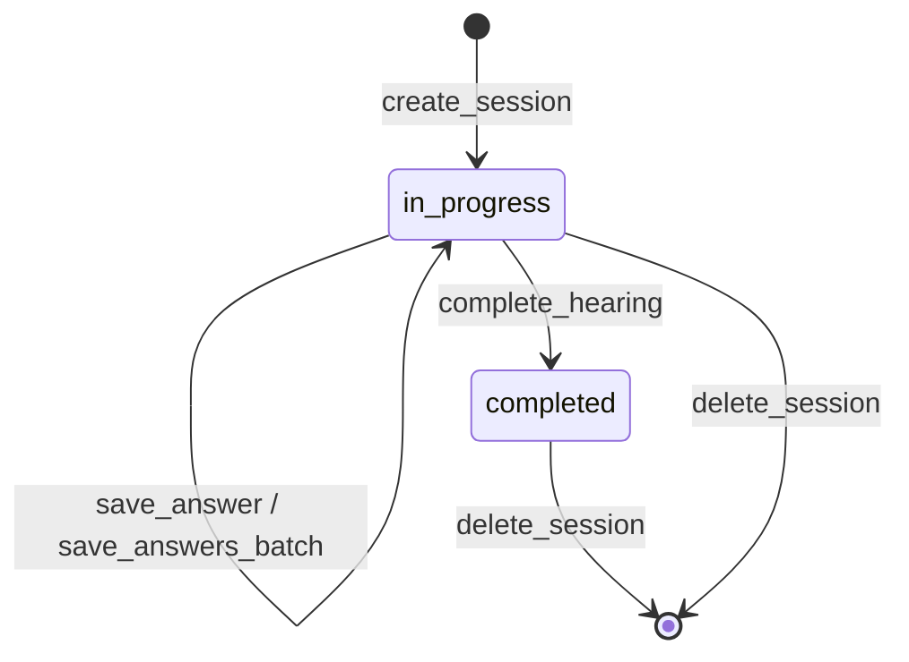

# 開発ガイドライン（Development Guidelines）

## 1. コーディング規約

### 1.1 TypeScript設定

プロジェクト全体で厳密な型チェックを適用する。

```json
{
  "compilerOptions": {
    "strict": true,
    "noUncheckedIndexedAccess": true,
    "noImplicitReturns": true,
    "noFallthroughCasesInSwitch": true,
    "module": "Node16",
    "target": "ES2022"
  }
}
```

| ルール | 説明 |
|-------|------|
| `strict: true` | `strictNullChecks`、`noImplicitAny` 等を一括有効化 |
| `noUncheckedIndexedAccess` | 配列・オブジェクトのインデックスアクセスに `undefined` チェックを強制 |
| `noImplicitReturns` | すべてのコードパスで値を返すことを強制 |
| `module: "Node16"` | ESMモジュール解決。import文に `.js` 拡張子を要求 |

> **`exactOptionalPropertyTypes` について**: MCP SDKやZodの型定義との互換性を確認した上で、実装段階で有効化を検討する。初期段階では有効化しない。

### 1.2 モジュールシステム

- ESM（ECMAScript Modules）を使用する（`"type": "module"` in package.json）
- import文では拡張子 `.js` を明記する（TypeScriptでも `.js`）

```typescript
// 正しい
import { Storage } from '../core/storage.js';
import { HearingResult } from '../types/index.js';

// 誤り
import { Storage } from '../core/storage';
import { Storage } from '../core/storage.ts';
```

### 1.3 exportルール

named export を使用する。default export は使用しない。

```typescript
// 正しい
export function createSession(args: CreateSessionArgs): Promise<Session> { ... }
export class GalleyError extends Error { ... }

// 誤り
export default function createSession(args: CreateSessionArgs): Promise<Session> { ... }
```

**理由**: named export はリファクタリング時の追跡が容易で、バレルファイル（`types/index.ts`）での re-export と一貫性がある。

### 1.4 `console.log()` の使用禁止

stdioトランスポートではstdoutがJSON-RPCプロトコル専用のため、`console.log()` はプロトコルを破壊する。

```typescript
// 禁止
console.log('debug message');

// 開発時デバッグ（stderr出力）
console.error('debug message');     // stderr → プロトコルに影響しない
console.warn('potential issue');    // stderr → プロトコルに影響しない

// 推奨: Loggerモジュールを使用
logger.debug('debug message');              // → stderr
logger.sendToClient('info', 'message');     // → MCP sendLoggingMessage
```

ESLintルールで `console.log` を `error` レベルで検出する（1.9参照）。

### 1.5 エラーハンドリング

#### アプリケーションエラー

すべてのアプリケーションエラーは `GalleyError` を使用する。

```typescript
// エラー定義（src/core/errors.ts）
export class GalleyError extends Error {
  constructor(
    public readonly code: GalleyErrorCode,
    message: string,
    public readonly cause?: unknown
  ) {
    super(message);
    this.name = 'GalleyError';
  }
}

// エラーコード
export type GalleyErrorCode =
  | 'SESSION_NOT_FOUND'
  | 'INVALID_SESSION_STATUS'
  | 'VALIDATION_ERROR'
  | 'FILE_READ_ERROR'
  | 'FILE_WRITE_ERROR'
  | 'INVALID_FILENAME'
  | 'PATH_TRAVERSAL'
  | 'CONFIG_LOAD_ERROR';
```

#### Tool ハンドラでの共通エラー処理

Toolハンドラは12個以上あるため、個々のハンドラに try-catch を書く代わりに共通ラッパー関数で統一する。

```typescript
// Tool ハンドラの共通ラッパー（src/server.ts または hearing/tools.ts 等）
function wrapToolHandler(
  handler: (args: unknown) => Promise<{ content: Array<{ type: string; text: string }> }>,
) {
  return async (args: unknown) => {
    try {
      return await handler(args);
    } catch (error) {
      if (error instanceof GalleyError) {
        return {
          content: [{ type: 'text' as const, text: `Error [${error.code}]: ${error.message}` }],
          isError: true,
        };
      }
      logger.error('Unexpected error', error);
      return {
        content: [{ type: 'text' as const, text: 'Internal server error' }],
        isError: true,
      };
    }
  };
}

// 使用例
server.setRequestHandler(CallToolRequestSchema, async (request) => {
  switch (request.params.name) {
    case 'create_session':
      return wrapToolHandler(handleCreateSession)(request.params.arguments);
    case 'save_answer':
      return wrapToolHandler(handleSaveAnswer)(request.params.arguments);
    // ...
  }
});
```

#### エラーメッセージの方針

| ルール | 説明 |
|-------|------|
| ファイルの絶対パスを含めない | 情報漏洩防止。相対パスまたはファイル名のみを使用 |
| エラーコードを含める | プログラムで判別可能にする |
| 内部情報を露出しない | スタックトレースやシステムパスをクライアントに返さない |

### 1.6 バリデーション

#### Tool引数のバリデーション

すべてのTool引数はZodスキーマでバリデーションする。

```typescript
import { z } from 'zod';

// スキーマ定義
const CreateSessionArgsSchema = z.object({
  project_description: z.string().min(1).max(1000),
});

// 型の導出
type CreateSessionArgs = z.infer<typeof CreateSessionArgsSchema>;
```

#### YAML設定ファイルのバリデーション

`config/` のYAMLファイルも読み込み時にZodスキーマでバリデーションする。

```typescript
// 設定ファイル用のスキーマ定義例
const HearingQuestionsConfigSchema = z.object({
  version: z.string(),
  categories: z.array(z.object({
    id: z.string(),
    label: z.string(),
    questions: z.array(z.object({
      id: z.string(),
      text: z.string(),
      options: z.array(z.string()).optional(),
    })),
  })),
});

// 読み込み時にバリデーション
const raw = yaml.parse(await readFile(configPath, 'utf-8'));
const config = HearingQuestionsConfigSchema.parse(raw);
```

#### バリデーションの配置

| 境界 | バリデーション方法 |
|------|----------------|
| Tool引数（外部入力） | Zodスキーマで厳密にバリデーション |
| ファイルから読み込んだJSON | Zodスキーマでパースし、不正データを早期検出 |
| YAMLから読み込んだ設定 | Zodスキーマでパースし、不正設定を早期検出 |
| モジュール間の内部呼び出し | TypeScriptの型システムに委任（ランタイムバリデーションは不要） |

### 1.7 非同期処理

- ファイルI/Oは常に非同期API（`fs/promises`）を使用する
- `fs.readFileSync` 等の同期APIは使用禁止（MCPサーバーのイベントループをブロックする）
- 例外: プロセス起動時の初期化処理（設定ファイル読み込み等）は同期でも可

```typescript
// 正しい
import { readFile, writeFile } from 'node:fs/promises';
const data = await readFile(filePath, 'utf-8');

// 誤り
import { readFileSync } from 'node:fs';
const data = readFileSync(filePath, 'utf-8');
```

### 1.8 依存パッケージの方針

| ルール | 説明 |
|-------|------|
| 依存最小化 | Node.js標準ライブラリで実現可能な機能は外部パッケージを使わない |
| 日時処理 | `Date.toISOString()` を使用。`date-fns` 等の日時ライブラリは導入しない |
| UUID生成 | `crypto.randomUUID()` を優先。不足があれば `uuid` パッケージを使用 |
| バージョン固定 | `package-lock.json` をコミットし、依存バージョンを固定する |

### 1.9 ESLint設定

ESLint 9以降のフラットコンフィグ形式（`eslint.config.js`）を使用する。

```javascript
// eslint.config.js
import eslint from '@eslint/js';
import tseslint from 'typescript-eslint';
import prettier from 'eslint-config-prettier';

export default tseslint.config(
  eslint.configs.recommended,
  ...tseslint.configs.recommendedTypeChecked,
  prettier,
  {
    languageOptions: {
      parserOptions: {
        project: './tsconfig.json',
      },
    },
    rules: {
      // console.log を禁止（console.error, console.warn は許可）
      'no-console': ['error', { allow: ['error', 'warn'] }],
      // 未使用変数（_ プレフィックスは許可）
      '@typescript-eslint/no-unused-vars': ['error', { argsIgnorePattern: '^_' }],
      // any の使用を禁止
      '@typescript-eslint/no-explicit-any': 'error',
      // 非null アサーション演算子の使用を警告
      '@typescript-eslint/no-non-null-assertion': 'warn',
      // Promise の戻り値を無視しない
      '@typescript-eslint/no-floating-promises': 'error',
      // async 関数で await がない場合にエラー
      '@typescript-eslint/require-await': 'error',
    },
  },
  {
    // テストファイルの緩和ルール
    files: ['tests/**/*.test.ts'],
    rules: {
      '@typescript-eslint/no-explicit-any': 'off',
    },
  },
);
```

**必要な devDependencies**:
- `eslint` (v9+)
- `typescript-eslint`
- `eslint-config-prettier`
- `@eslint/js`

### 1.10 Prettier設定

```json
{
  "semi": true,
  "singleQuote": true,
  "trailingComma": "all",
  "printWidth": 100,
  "tabWidth": 2
}
```

---

## 2. 命名規則

### 2.1 ファイル・ディレクトリ

| 対象 | 規則 | 例 |
|------|------|-----|
| TypeScriptファイル | kebab-case | `storage.ts`、`hearing-result.ts` |
| テストファイル | `{対象}.test.ts` | `storage.test.ts` |
| ディレクトリ | kebab-case | `hearing/`、`core/` |
| YAML設定ファイル | kebab-case | `oci-services.yaml` |
| プロンプトテンプレート | kebab-case | `start-hearing.md` |

### 2.2 TypeScriptコード

| 対象 | 規則 | 例 |
|------|------|-----|
| 変数・関数 | camelCase | `sessionId`、`createSession()` |
| 定数（モジュールレベル） | UPPER_SNAKE_CASE | `DEFAULT_CONFIG_DIR`、`MAX_SESSIONS` |
| 型・インターフェース | PascalCase | `HearingResult`、`SessionStatus` |
| Zodスキーマ | PascalCase + `Schema` 接尾辞 | `CreateSessionArgsSchema` |
| Zodスキーマから導出した型 | PascalCase（`Schema` なし） | `CreateSessionArgs` |
| Enum（Zodのenum） | PascalCase（型名）、snake_case（値） | `AnswerSource` の値: `user_selected`、`estimated` |
| クラス | PascalCase | `GalleyError`、`Logger` |
| MCP Tool名 | snake_case | `create_session`、`save_answer` |
| MCP Resource URI | kebab-case（パスセグメント） | `galley://templates/hearing-questions` |
| MCP Prompt名 | kebab-case | `start-hearing`、`generate-architecture` |

### 2.3 JSONフィールド

ヒアリング結果JSON、セッションJSON等のデータファイルのフィールド名は **snake_case** を使用する。

```json
{
  "metadata": {
    "hearing_id": "...",
    "created_at": "...",
    "updated_at": "..."
  },
  "project_overview": {
    "project_type": "..."
  }
}
```

**理由**: MCP SDKのTool引数・レスポンスの慣例（snake_case）に合わせる。TypeScriptコード内ではZodスキーマが snake_case のJSONフィールドを camelCase に変換せず、そのまま snake_case で扱う。

### 2.4 エラーコード

UPPER_SNAKE_CASE を使用する。

```typescript
type GalleyErrorCode =
  | 'SESSION_NOT_FOUND'
  | 'VALIDATION_ERROR'
  | 'FILE_WRITE_ERROR';
```

---

## 3. フォーマット規約

### 3.1 自動フォーマット

コードのフォーマットはPrettierに委任する。手動でのフォーマット調整は行わない。

| 設定 | 値 | 備考 |
|------|-----|------|
| セミコロン | あり | `semi: true` |
| クォート | シングル | `singleQuote: true` |
| 末尾カンマ | あり | `trailingComma: "all"` |
| 行幅 | 100文字 | `printWidth: 100` |
| インデント | スペース2 | `tabWidth: 2` |

### 3.2 フォーマット対象

| 対象 | 含む | 備考 |
|------|------|------|
| `src/**/*.ts` | はい | アプリケーションコード |
| `tests/**/*.ts` | はい | テストコード |
| `*.md` | はい | ドキュメント（Prettierのデフォルト） |
| `*.yaml` | はい | 設定ファイル |
| `*.json` | はい | package.json、tsconfig.json等 |

### 3.3 import文の整理

import文は以下のグループ順に整理し、グループ間に空行を入れる。

```typescript
// 1. Node.js標準モジュール
import path from 'node:path';
import { readFile } from 'node:fs/promises';

// 2. 外部パッケージ
import { z } from 'zod';
import { McpServer } from '@modelcontextprotocol/sdk/server/mcp.js';

// 3. プロジェクト内モジュール（相対パス）
import { Storage } from '../core/storage.js';
import { HearingResult } from '../types/index.js';
```

### 3.4 YAML設定ファイル

| 設定 | 値 |
|------|-----|
| インデント | スペース2 |
| 文字列引用符 | 値にコロンや特殊文字を含む場合のみクォート |
| コメント | セクション区切りと意図の説明に使用 |

---

## 4. テスト規約

### 4.1 テストの分類と範囲

| 分類 | ツール | 対象 | MVP段階の実施 |
|------|-------|------|-------------|
| ユニットテスト | Vitest | 個々の関数・モジュール | 必須 |
| 統合テスト | MCP Inspector | MCPプロトコル経由のE2E | 手動で実施 |
| E2Eテスト | Claude Desktop | 実際のAIクライアントでのフロー | 手動で実施 |

### 4.2 Vitest設定

```typescript
// vitest.config.ts
import { defineConfig } from 'vitest/config';

export default defineConfig({
  test: {
    include: ['tests/**/*.test.ts'],
    coverage: {
      provider: 'v8',
      include: ['src/**/*.ts'],
      exclude: ['src/types/**'],
      thresholds: {
        // core/ は高カバレッジを要求
        'src/core/': { statements: 90 },
      },
    },
  },
});
```

### 4.3 ユニットテストの書き方

#### テストの構造

`describe` - `it` 構造を使用する。テスト名は英語で記述する。

```typescript
import { describe, it, expect, vi, beforeEach } from 'vitest';

describe('createSession', () => {
  beforeEach(() => {
    vi.clearAllMocks();
  });

  it('should create a new session with valid project description', async () => {
    // Arrange
    const args = { project_description: 'Inventory management system' };

    // Act
    const result = await createSession(args);

    // Assert
    expect(result.session_id).toBeDefined();
    expect(result.session_id).toMatch(/^[0-9a-f-]{36}$/);
  });

  it('should throw VALIDATION_ERROR when project_description is empty', async () => {
    const args = { project_description: '' };

    await expect(createSession(args)).rejects.toThrow(GalleyError);
  });
});
```

#### テストのパターン

| パターン | 説明 |
|---------|------|
| Arrange-Act-Assert | テストは準備・実行・検証の3段階で構成する |
| モック化 | ファイルI/Oは `vi.mock()` でモック化する。実際のファイルシステムへのアクセスは `core/storage.test.ts` のみ |
| フィクスチャ | テストデータは `tests/fixtures/` から読み込む |
| 独立性 | 各テストは他のテストに依存しない。`beforeEach` でモックをリセットする |

#### カバレッジ目標

| 対象 | カバレッジ目標 | 理由 |
|------|-------------|------|
| `core/` | > 90% | ファイルI/O・バリデーション等の基盤は高信頼が必要 |
| `hearing/tools.ts` | > 80% | ビジネスロジックの正確性を担保 |
| `generate/tools.ts` | > 80% | ファイル出力の正確性を担保 |
| `*/resources.ts` | > 60% | 設定ファイル読み込みが主なので、正常系中心 |
| `*/prompts.ts` | > 60% | テンプレート変数展開が正しいことを確認 |

### 4.4 モックの方針

```typescript
// Storage のモック例
vi.mock('../core/storage.js', () => ({
  readJson: vi.fn(),
  writeJson: vi.fn(),
  exists: vi.fn(),
}));

// テスト内でモックの振る舞いを設定
import { readJson, writeJson } from '../core/storage.js';

it('should save answer to existing session', async () => {
  vi.mocked(readJson).mockResolvedValue(mockHearingResult);
  vi.mocked(writeJson).mockResolvedValue(undefined);

  const result = await saveAnswer(args);

  expect(writeJson).toHaveBeenCalledWith(
    expect.stringContaining('hearing-result.json'),
    expect.objectContaining({ /* ... */ }),
  );
});
```

### 4.5 テストの実行

```bash
# 全テスト実行
npm test

# ウォッチモード（開発中）
npm run test:watch

# カバレッジレポート付き
npx vitest run --coverage
```

---

## 5. Git規約

### 5.1 ブランチ戦略

MVP段階では簡易なブランチ戦略を採用する。

```
main（安定版）
  └── feature/{feature-name}    ... 機能追加
  └── fix/{fix-description}     ... バグ修正
  └── docs/{document-name}      ... ドキュメント変更
```

| ブランチ | 用途 | マージ先 |
|---------|------|---------|
| `main` | 安定版。リリース可能な状態を維持 | — |
| `feature/*` | 新機能の開発 | `main` |
| `fix/*` | バグ修正 | `main` |
| `docs/*` | ドキュメントのみの変更 | `main` |

- ブランチ名は英語の kebab-case（例: `feature/add-batch-save`、`fix/path-traversal-validation`）
- `main` への直接コミットは避け、Pull Requestを通してマージする
- MVP段階は1人開発のため、レビューは任意とする

### 5.2 コミットメッセージ

[Conventional Commits](https://www.conventionalcommits.org/) に準拠する。

#### フォーマット

```
<type>(<scope>): <description>

[body]
```

- **description**（1行目）: 英語で記述。小文字始まり、末尾ピリオドなし
- **body**（2行目以降）: 任意。英語または日本語。変更の意図や背景を記述

#### type

| type | 用途 |
|------|------|
| `feat` | 新機能の追加 |
| `fix` | バグ修正 |
| `refactor` | リファクタリング（機能変更なし） |
| `test` | テストの追加・修正 |
| `docs` | ドキュメントの追加・修正 |
| `chore` | ビルド設定・依存パッケージ更新等 |
| `style` | コードフォーマットの変更（ロジック変更なし） |

#### scope

| scope | 対象 |
|-------|------|
| `hearing` | hearing モジュール |
| `generate` | generate モジュール |
| `core` | core モジュール |
| `config` | 設定ファイル |
| `prompts` | プロンプトテンプレート |
| `deps` | 依存パッケージ |

#### 例

```
feat(hearing): add save_answers_batch tool for batch saving

fix(core): prevent path traversal in validateOutputPath

refactor(generate): extract Mermaid rendering logic

test(hearing): add unit tests for complete_hearing

docs: update architecture document with logging strategy

chore(deps): update @modelcontextprotocol/sdk to 1.3.0
```

### 5.3 コミットの粒度

| ルール | 説明 |
|-------|------|
| 1コミット1変更 | 機能追加とバグ修正を同じコミットに含めない |
| ビルドが通る状態 | 各コミットでビルド・テストが通る状態を維持する |
| WIPコミット禁止 | `main` にマージされるコミットに `WIP` を含めない |

### 5.4 Pull Request

#### タイトル

コミットメッセージと同じ Conventional Commits フォーマットを使用する（英語）。

#### 説明テンプレート

```markdown
## Summary
<!-- Brief description of the changes (1-3 lines) -->

## Changes
<!-- Key changes as bullet points -->

## Checklist
- [ ] Unit tests added / updated
- [ ] `npm test` — all tests pass
- [ ] `npm run typecheck` — no errors
- [ ] `npm run lint` — no errors
- [ ] Tested with MCP Inspector (if applicable)
```

---

## 6. 品質チェック

### 6.1 開発ワークフロー

日常の開発は以下のフローで行う。

```bash
# 1. コード修正
# （エディタで src/ のファイルを編集）

# 2. ビルド（ウォッチモードなら自動）
npm run build          # 単発ビルド
# npm run dev          # ウォッチモード

# 3. ユニットテスト
npm test

# 4. MCP Inspectorで動作確認
npm run inspect        # ブラウザUIでResources/Tools/Promptsを操作

# 5. Claude Desktopで統合テスト（必要な場合のみ）
# Claude Desktopの設定で galley MCPサーバーを登録して実際に使用
```

### 6.2 コミット前チェックリスト

コードをコミットする前に、以下を確認する。

```bash
npm run typecheck && npm run lint && npm test && npm run build
```

### 6.3 品質ゲート

| チェック | コマンド | 合格条件 |
|---------|---------|---------|
| TypeScript型チェック | `npm run typecheck` | エラー0件 |
| ESLint | `npm run lint` | エラー0件（警告は許容） |
| Prettier | `npx prettier --check 'src/**' 'tests/**'` | 差分0件 |
| ユニットテスト | `npm test` | 全テストパス |
| ビルド | `npm run build` | エラーなしでビルド完了 |

### 6.4 npmスクリプト

```json
{
  "scripts": {
    "build": "tsup",
    "dev": "tsup --watch",
    "start": "node dist/index.js",
    "test": "vitest run",
    "test:watch": "vitest",
    "lint": "eslint 'src/**/*.ts' 'tests/**/*.ts'",
    "format": "prettier --write 'src/**' 'tests/**'",
    "format:check": "prettier --check 'src/**' 'tests/**'",
    "typecheck": "tsc --noEmit",
    "inspect": "npx @modelcontextprotocol/inspector node dist/index.js"
  }
}
```

### 6.5 pre-commitフック

MVP段階ではpre-commitフックは導入しない（1人開発のためオーバーヘッドが大きい）。チーム展開時に `husky` + `lint-staged` で以下を自動化する。

```json
{
  "lint-staged": {
    "*.ts": ["eslint --fix", "prettier --write"],
    "*.{md,yaml,json}": ["prettier --write"]
  }
}
```

### 6.6 将来の自動化（CI/CD導入時）

MVP段階では手動実行。チーム展開時にGitHub Actionsで自動化する。

```yaml
# .github/workflows/ci.yml（将来導入）
name: CI
on: [push, pull_request]
jobs:
  check:
    runs-on: ubuntu-latest
    steps:
      - uses: actions/checkout@v4
      - uses: actions/setup-node@v4
        with:
          node-version: 22
      - run: npm ci
      - run: npm run typecheck
      - run: npm run lint
      - run: npm run format:check
      - run: npm test
      - run: npm run build
```

---

## 7. MCP固有の開発ルール

### 7.1 stdioプロトコルの遵守

| ルール | 理由 |
|-------|------|
| `console.log()` を使用しない | stdoutはJSON-RPCプロトコル専用 |
| デバッグ出力は `console.error()` / `console.warn()` | stderrはプロトコルに影響しない |
| 構造化ログは `server.sendLoggingMessage()` | AIクライアントに構造化情報を送信 |

### 7.2 Resource変更通知

`create_session` / `delete_session` 実行後は、セッション一覧Resourceの変更を通知する。

```typescript
// McpServer クラスを使用する場合、管理メソッド経由の変更は自動通知される
// 手動で通知する場合:
server.sendResourcesListChanged();
```

> **クライアントサポート**: `notifications/resources/list_changed` はすべてのAIクライアントでサポートされているわけではない。通知が無視されても動作に支障がないよう設計する。

### 7.3 Tool の description 設計

Prompts非対応のAIクライアントでも正しく動作するよう、Toolの `description` に十分な情報を含める。

```typescript
{
  name: 'create_session',
  description:
    'Create a new hearing session. Call this first before starting ' +
    'the hearing process. Pass the project description from the user.',
  inputSchema: {
    type: 'object',
    properties: {
      project_description: {
        type: 'string',
        description: 'Brief description of the project/demo requirements',
      },
    },
    required: ['project_description'],
  },
}
```

### 7.4 セッションデータの整合性

セッションのステータス遷移は一方向のみ。



| ルール | 説明 |
|-------|------|
| ステータス遷移 | `in_progress` → `completed` の一方向のみ。逆方向の遷移は不可 |
| 完了後の保護 | `completed` 状態のセッションへの `save_answer` はエラーとする |
| 未回答の許容 | `complete_hearing` は未回答の質問がある場合でも実行可能。未回答は `not_answered` として記録 |
