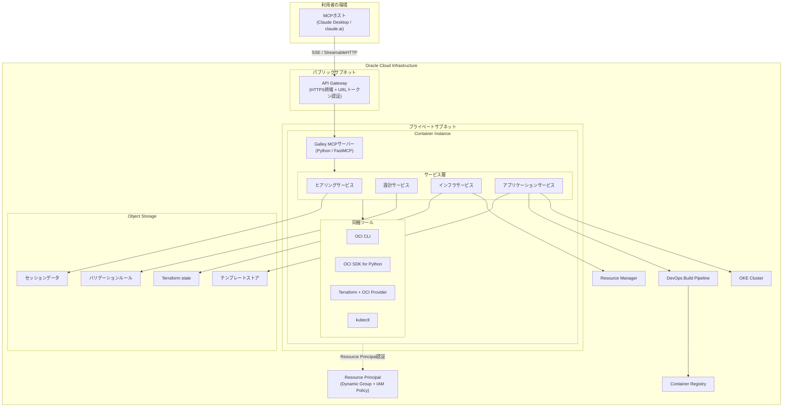
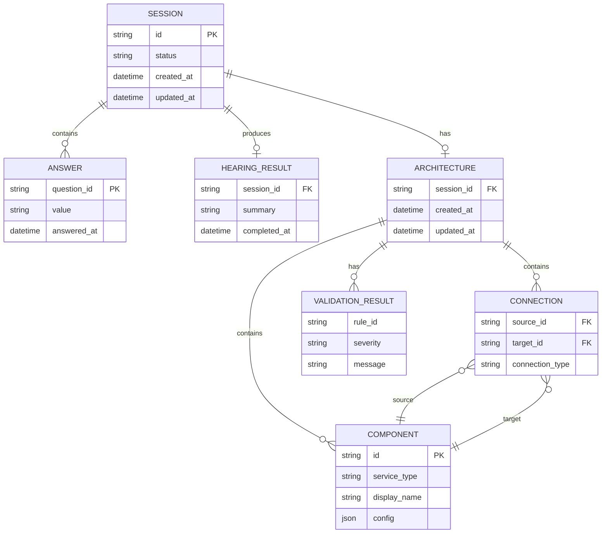
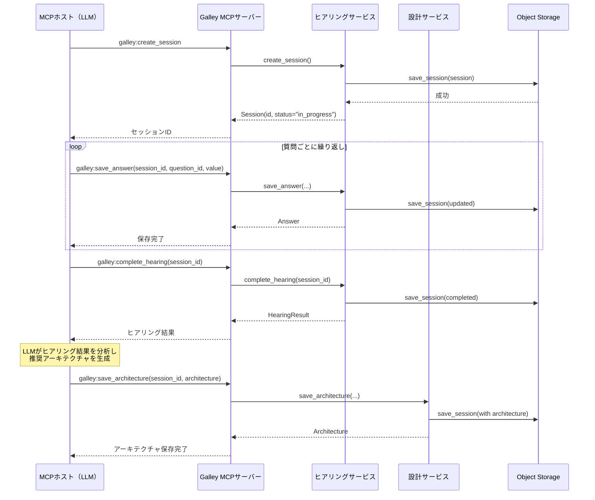
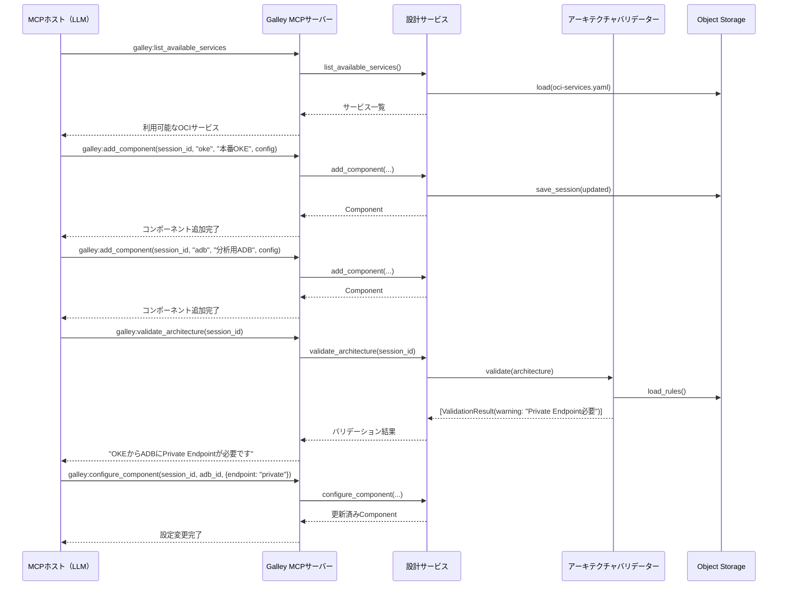
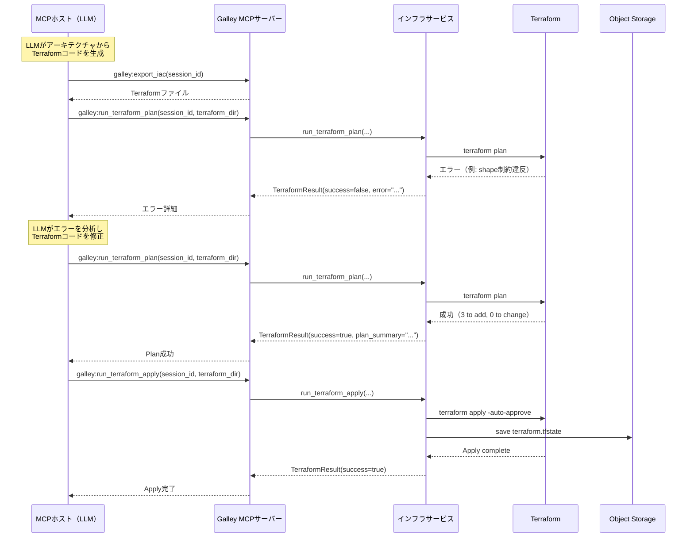
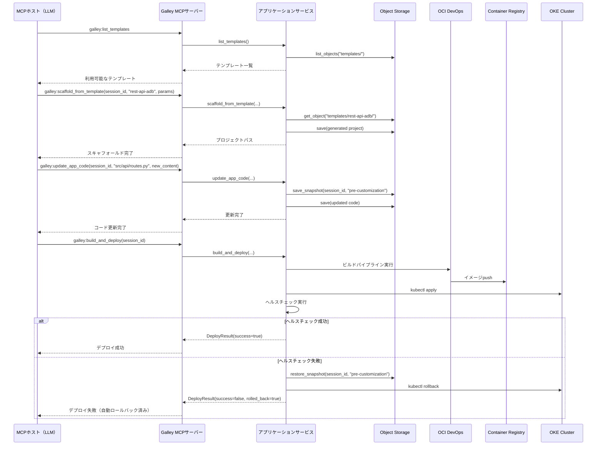
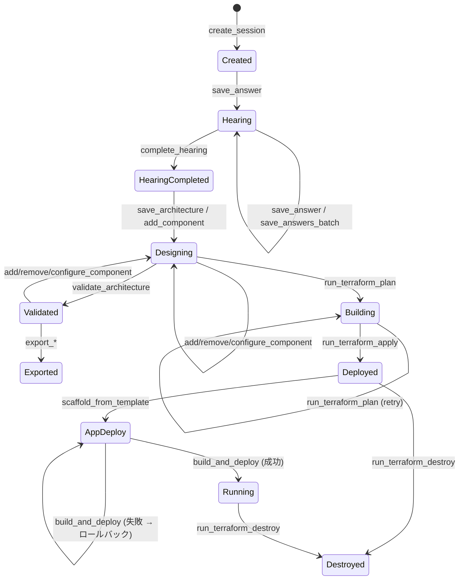

# 機能設計書 (Functional Design Document)

## システム構成図



## 技術スタック

| 分類 | 技術 | 選定理由 |
|------|------|----------|
| 言語 | Python 3.12+ | OCI SDK for Pythonとの親和性、FastMCPの対応言語 |
| MCPフレームワーク | FastMCP | Python向けMCPサーバー実装の標準フレームワーク |
| OCI操作 | OCI CLI / OCI SDK for Python | CLI: 汎用コマンド実行、SDK: 構造化API呼び出し |
| IaC | Terraform + OCI Provider | OCIリソースのプロビジョニング標準ツール |
| コンテナ管理 | kubectl | OKEクラスターへのデプロイ操作 |
| 認証 | Resource Principal | Container Instance向けのキーレス認証 |
| データ永続化 | OCI Object Storage | スケーラブルなオブジェクトストレージ |
| パッケージ管理 | uv | 高速なPythonパッケージマネージャー |

## データモデル定義

### エンティティ: Session（ヒアリングセッション）

```python
@dataclass
class Session:
    id: str                          # UUID v4
    status: SessionStatus            # "in_progress" | "completed"
    answers: dict[str, Answer]       # 質問ID → 回答のマッピング
    hearing_result: HearingResult | None  # ヒアリング完了後の構造化結果
    architecture: Architecture | None     # 設計済みアーキテクチャ
    created_at: datetime             # 作成日時（UTC）
    updated_at: datetime             # 更新日時（UTC）

SessionStatus = Literal["in_progress", "completed"]
```

**制約**:
- `id` はセッション作成時にUUID v4で自動生成
- `status` が `"completed"` の場合、`hearing_result` は必須
- `answers` のキーはヒアリング質問定義の `question_id` と一致する

**永続化ステータスとワークフロー状態の関係**:

`SessionStatus` は永続化モデル上のステータスであり、2値（`"in_progress"` / `"completed"`）のみ。
状態遷移図（後述）に示す `Created` → `Hearing` → `HearingCompleted` → `Designing` → ... の各状態は、セッション内のデータ（`answers` の有無、`hearing_result` の有無、`architecture` の有無等）から論理的に導出される **ワークフロー状態** である。永続化されるのは `status` フィールドのみ。

| ワークフロー状態 | 永続化 status | 導出条件 |
|----------------|-------------|---------|
| Created | in_progress | answers == {} |
| Hearing | in_progress | answers != {} かつ hearing_result == None |
| HearingCompleted | completed | hearing_result != None かつ architecture == None |
| Designing | completed | architecture != None かつ validation_results == None |
| Validated | completed | architecture.validation_results != None |
| Building / Deployed / ... | completed | 外部リソース状態による（Terraform state等） |

### エンティティ: Answer（ヒアリング回答）

```python
@dataclass
class Answer:
    question_id: str                 # 質問ID
    value: str | list[str]           # 回答値（テキストまたは複数選択）
    answered_at: datetime            # 回答日時（UTC）
```

### エンティティ: HearingResult（ヒアリング結果）

```python
@dataclass
class HearingResult:
    session_id: str                  # セッションID
    summary: str                     # 要件サマリー（Markdown）
    requirements: list[Requirement]  # 構造化された要件リスト
    constraints: list[str]           # 制約事項
    completed_at: datetime           # 完了日時（UTC）

@dataclass
class Requirement:
    category: str                    # "compute" | "database" | "network" | "security" | "other"
    description: str                 # 要件の説明
    priority: str                    # "must" | "should" | "could"
```

### エンティティ: Architecture（アーキテクチャ）

```python
@dataclass
class Architecture:
    session_id: str                          # セッションID
    components: list[Component]              # コンポーネント一覧
    connections: list[Connection]            # コンポーネント間の接続
    validation_results: list[ValidationResult] | None  # 最新のバリデーション結果
    created_at: datetime                     # 作成日時（UTC）
    updated_at: datetime                     # 更新日時（UTC）

@dataclass
class Component:
    id: str                          # コンポーネントID（UUID v4）
    service_type: str                # OCIサービス種別（例: "oke", "adb", "apigateway"）
    display_name: str                # 表示名
    config: dict[str, Any]           # サービス固有の設定（シェイプ、ネットワーク等）
    customizable: bool               # カスタマイズ可能フラグ（デフォルト: True）

@dataclass
class Connection:
    source_id: str                   # 接続元コンポーネントID
    target_id: str                   # 接続先コンポーネントID
    connection_type: str             # "private_endpoint" | "public" | "service_gateway" | "vcn_peering"
    description: str                 # 接続の説明
```

**制約**:
- `connections` の `source_id` / `target_id` は `components` 内の `id` と一致する
- `service_type` はバリデーションルールで定義されたサービス一覧に含まれる

### エンティティ: ValidationResult（バリデーション結果）

```python
@dataclass
class ValidationResult:
    severity: str                    # "error" | "warning" | "info"
    rule_id: str                     # バリデーションルールID
    message: str                     # 問題の説明
    affected_components: list[str]   # 影響を受けるコンポーネントID
    recommendation: str              # 推奨する対応
```

### エンティティ: Template（アプリケーションテンプレート）

```python
@dataclass
class TemplateMetadata:
    name: str                        # テンプレート名（例: "rest-api-adb"）
    display_name: str                # 表示名（例: "REST API + Autonomous Database"）
    description: str                 # テンプレートの説明
    parameters: list[TemplateParameter]  # カスタマイズ可能なパラメータ
    protected_paths: list[str]       # カスタマイズ不可のファイルパスパターン

@dataclass
class TemplateParameter:
    name: str                        # パラメータ名
    description: str                 # パラメータの説明
    param_type: str                  # "string" | "number" | "boolean" | "choice"
    required: bool                   # 必須フラグ
    default: Any | None              # デフォルト値
    choices: list[str] | None        # param_type="choice" の場合の選択肢
```

### エンティティ: TerraformResult（Terraform実行結果）

```python
@dataclass
class TerraformResult:
    success: bool                    # 実行成功フラグ
    command: str                     # 実行コマンド（"plan" | "apply" | "destroy"）
    stdout: str                      # 標準出力
    stderr: str                      # 標準エラー出力
    exit_code: int                   # 終了コード
    plan_summary: str | None         # plan時のサマリー（例: "3 to add, 0 to change"）
```

### エンティティ: RMStack / RMJob（Resource Manager関連）

```python
@dataclass
class RMStack:
    id: str                          # Resource ManagerスタックOCID
    compartment_id: str              # コンパートメントOCID
    display_name: str                # 表示名
    terraform_version: str           # Terraformバージョン
    lifecycle_state: str             # "ACTIVE" | "DELETED" 等
    created_at: datetime             # 作成日時（UTC）

@dataclass
class RMJob:
    id: str                          # ジョブOCID
    stack_id: str                    # スタックOCID
    operation: str                   # "PLAN" | "APPLY" | "DESTROY"
    lifecycle_state: str             # "ACCEPTED" | "IN_PROGRESS" | "SUCCEEDED" | "FAILED"
    log_location: str | None         # ログの格納先

RMJobStatus = Literal["ACCEPTED", "IN_PROGRESS", "SUCCEEDED", "FAILED", "CANCELING", "CANCELED"]
```

### エンティティ: CLIResult / DeployResult / AppStatus（操作結果）

```python
@dataclass
class CLIResult:
    success: bool                    # 実行成功フラグ
    stdout: str                      # 標準出力（JSON文字列の場合あり）
    stderr: str                      # 標準エラー出力
    exit_code: int                   # 終了コード

@dataclass
class DeployResult:
    success: bool                    # デプロイ成功フラグ
    image_uri: str | None            # デプロイしたコンテナイメージURI
    endpoint: str | None             # アクセスエンドポイント
    rolled_back: bool                # 自動ロールバック実行フラグ
    reason: str | None               # 失敗時の理由

@dataclass
class AppStatus:
    session_id: str                  # セッションID
    status: str                      # "not_deployed" | "deploying" | "running" | "failed"
    endpoint: str | None             # アクセスエンドポイント
    health_check: dict | None        # 直近のヘルスチェック結果
    last_deployed_at: datetime | None  # 最終デプロイ日時（UTC）
```

### ER図



**注**: ER図はデータの論理的な関係を示す。実際の永続化ではAnswerはSession.answers辞書内に格納されるため、独立したsession_id FKは持たない（親Sessionのキーにより暗黙的に関連付けられる）。

## コンポーネント設計

### MCPサーバー層

**責務**:
- FastMCPによるMCPプロトコルの処理（SSE / StreamableHTTP）
- MCPツール・リソース・プロンプトの登録と呼び出しルーティング
- リクエストの認証情報検証（API Gatewayで処理済み前提）

```python
class GalleyServer:
    """FastMCPベースのMCPサーバー。各サービスのツールを登録・公開する。"""
    def __init__(self, config: ServerConfig): ...
    def register_tools(self) -> None: ...
    def register_resources(self) -> None: ...
    def register_prompts(self) -> None: ...
    async def run(self) -> None: ...
```

**依存関係**:
- FastMCP
- 各サービス層のクラス

### ヒアリングサービス

**責務**:
- ヒアリングセッションのライフサイクル管理（作成→回答保存→完了）
- ヒアリング質問定義の読み込みとフロー制御
- 回答の構造化と要件への変換

```python
class HearingService:
    """ヒアリングセッションの管理とフロー制御を行う。"""
    def __init__(self, storage: StorageService, config: HearingConfig): ...
    async def create_session(self) -> Session: ...
    async def save_answer(self, session_id: str, question_id: str, value: str | list[str]) -> Answer: ...
    async def save_answers_batch(self, session_id: str, answers: list[dict]) -> list[Answer]: ...
    async def complete_hearing(self, session_id: str) -> HearingResult: ...
    async def get_hearing_result(self, session_id: str) -> HearingResult: ...
```

**依存関係**:
- StorageService

### 設計サービス

**責務**:
- 自動設計モード：ヒアリング結果からの推奨アーキテクチャ生成
- 対話型設計モード：コンポーネントの追加・削除・設定変更
- アーキテクチャバリデーション（Object Storageのルールに基づく）
- エクスポート機能（Markdown、Mermaid、IaC）

```python
class DesignService:
    """アーキテクチャ設計の管理とバリデーションを行う。"""
    def __init__(self, storage: StorageService, validator: ArchitectureValidator): ...
    async def save_architecture(self, session_id: str, architecture: Architecture) -> Architecture: ...
    async def add_component(self, session_id: str, service_type: str, display_name: str, config: dict) -> Component: ...
    async def remove_component(self, session_id: str, component_id: str) -> None: ...
    async def configure_component(self, session_id: str, component_id: str, config: dict) -> Component: ...
    async def validate_architecture(self, session_id: str) -> list[ValidationResult]: ...
    async def list_available_services(self) -> list[ServiceInfo]: ...
    async def export_summary(self, session_id: str) -> str: ...
    async def export_mermaid(self, session_id: str) -> str: ...
    async def export_iac(self, session_id: str) -> str: ...
    async def export_all(self, session_id: str) -> dict[str, str]: ...
```

**依存関係**:
- StorageService
- ArchitectureValidator

### アーキテクチャバリデーター

**責務**:
- Object Storageからバリデーションルールを読み込み
- アーキテクチャ構成に対するルール適用
- バリデーション結果の生成

```python
class ArchitectureValidator:
    """バリデーションルールに基づくアーキテクチャ検証を行う。"""
    def __init__(self, storage: StorageService): ...
    async def load_rules(self) -> list[ValidationRule]: ...
    async def validate(self, architecture: Architecture) -> list[ValidationResult]: ...
```

### インフラサービス

**責務**:
- Galleyコンテナ内でのTerraform実行（plan / apply / destroy）
- OCI CLIコマンドの実行
- OCI SDK for Pythonによる構造化API呼び出し
- Resource Managerスタックの管理

```python
class InfraService:
    """インフラストラクチャの構築・管理を行う。"""
    def __init__(self, storage: StorageService, oci_client: OCIClientFactory): ...
    async def run_terraform_plan(self, session_id: str, terraform_dir: str) -> TerraformResult: ...
    async def run_terraform_apply(self, session_id: str, terraform_dir: str) -> TerraformResult: ...
    async def run_terraform_destroy(self, session_id: str, terraform_dir: str) -> TerraformResult: ...
    async def run_oci_cli(self, command: str) -> CLIResult: ...
    async def oci_sdk_call(self, service: str, operation: str, params: dict) -> dict: ...
    async def create_rm_stack(self, session_id: str, compartment_id: str, terraform_dir: str) -> RMStack: ...
    async def run_rm_plan(self, stack_id: str) -> RMJob: ...
    async def run_rm_apply(self, stack_id: str) -> RMJob: ...
    async def get_rm_job_status(self, job_id: str) -> RMJobStatus: ...
```

**依存関係**:
- StorageService
- OCIClientFactory

### アプリケーションサービス

**責務**:
- テンプレートストアの管理とテンプレート一覧取得
- テンプレートからのプロジェクトスキャフォールディング
- アプリケーションコードのカスタマイズ
- ビルド・デプロイパイプラインのオーケストレーション
- デプロイ状態の監視と自動ロールバック

```python
class AppService:
    """アプリケーションのテンプレート管理・デプロイを行う。"""
    def __init__(self, storage: StorageService, oci_client: OCIClientFactory): ...
    async def list_templates(self) -> list[TemplateMetadata]: ...
    async def scaffold_from_template(self, session_id: str, template_name: str, params: dict) -> str: ...
    async def update_app_code(self, session_id: str, file_path: str, new_content: str) -> None: ...
    async def build_and_deploy(self, session_id: str, cluster_id: str, image_uri: str | None = None, namespace: str = "default") -> DeployResult: ...
    async def check_app_status(self, session_id: str) -> AppStatus: ...
```

**依存関係**:
- StorageService
- OCIClientFactory

### 配布Terraformサービス（F3）

**責務**:
- Galley環境自体のプロビジョニング用Terraformの管理
- `deploy/` ディレクトリ内のTerraformファイル生成・更新
- `terraform apply` で作成されるリソース: API Gateway、Container Instance、Object Storage、VCN/Subnet、IAM Policy
- URLトークンの自動生成とTerraform output経由の出力

**構成ファイル（`deploy/` ディレクトリ）**:

| ファイル | 役割 |
|---------|------|
| `main.tf` | プロバイダー設定、変数参照 |
| `variables.tf` | 入力変数（compartment_id、region等） |
| `outputs.tf` | 出力値（MCPエンドポイントURL、URLトークン等） |
| `api-gateway.tf` | API GatewayとDeployment |
| `container-instance.tf` | Container Instance（Galleyサーバー） |
| `object-storage.tf` | Object Storageバケット |
| `network.tf` | VCN / Subnet / Security List |
| `iam.tf` | Dynamic Group / IAM Policy |

**注意**: F3はGalley MCPサーバーの機能ではなく、利用者がGalley環境を構築するためのTerraformコードである。MCPサーバーのコードとは独立して管理される。利用者は `deploy/` ディレクトリの `terraform apply` を実行することでGalley環境を構築できる。

### ストレージサービス

**責務**:
- OCI Object Storageへのデータ読み書き
- セッションデータ、Terraform state、テンプレート、バリデーションルールの管理
- スナップショットの保存とロールバック

```python
class StorageService:
    """OCI Object Storageを利用したデータ永続化層。"""
    def __init__(self, oci_client: OCIClientFactory, bucket_name: str, namespace: str): ...
    async def put_object(self, key: str, data: bytes) -> None: ...
    async def get_object(self, key: str) -> bytes: ...
    async def list_objects(self, prefix: str) -> list[str]: ...
    async def delete_object(self, key: str) -> None: ...
    async def save_session(self, session: Session) -> None: ...
    async def load_session(self, session_id: str) -> Session: ...
    async def save_snapshot(self, session_id: str, label: str) -> str: ...
    async def restore_snapshot(self, session_id: str, snapshot_id: str) -> None: ...
```

**依存関係**:
- OCIClientFactory（OCI SDK for Python の Object Storage クライアント）

### OCIクライアントファクトリ

**責務**:
- Resource Principal認証の初期化
- 各OCIサービスクライアントの生成と管理

```python
class OCIClientFactory:
    """Resource Principal認証に基づくOCIクライアントの生成と管理。"""
    def __init__(self): ...
    def get_object_storage_client(self) -> oci.object_storage.ObjectStorageClient: ...
    def get_resource_manager_client(self) -> oci.resource_manager.ResourceManagerClient: ...
    def get_container_instances_client(self) -> oci.container_instances.ContainerInstanceClient: ...
    def get_identity_client(self) -> oci.identity.IdentityClient: ...
```

## ユースケース図

### UC1: ヒアリング〜自動設計フロー



### UC2: 対話型設計フロー



### UC3: Terraform自動デバッグループ



### UC4: テンプレートデプロイフロー



## 状態遷移図

### セッションの状態遷移



## Object Storageデータ構造

```
galley-bucket/
├── sessions/
│   └── {session_id}/
│       ├── session.json           # セッションメタデータ
│       ├── hearing-result.json    # ヒアリング結果
│       ├── architecture.json      # アーキテクチャ定義
│       ├── terraform/             # 生成されたTerraformファイル
│       │   ├── main.tf
│       │   ├── variables.tf
│       │   └── terraform.tfstate
│       ├── app/                   # アプリケーションコード
│       │   └── ...
│       └── snapshots/             # スナップショット
│           └── {snapshot_id}/
│               └── ...
├── templates/
│   ├── rest-api-adb/
│   │   ├── template.json          # テンプレートメタデータ
│   │   ├── app/                   # アプリケーションコード
│   │   ├── k8s/                   # Kubernetesマニフェスト
│   │   └── terraform/             # インフラ定義
│   ├── frontend-oke/
│   └── fn-event-driven/
├── rules/
│   ├── connection-requirements.yaml  # サービス間接続要件
│   ├── region-availability.yaml      # リージョン別可用性
│   ├── shape-constraints.yaml        # シェイプ制約
│   └── network-best-practices.yaml   # ネットワークベストプラクティス
└── services/
    └── oci-services.yaml             # 利用可能なOCIサービス定義
```

### session.json の例

```json
{
  "id": "a1b2c3d4-e5f6-7890-abcd-ef1234567890",
  "status": "in_progress",
  "answers": {
    "purpose": {
      "question_id": "purpose",
      "value": "REST APIとデータベースを使ったWebアプリケーション",
      "answered_at": "2026-02-17T10:30:00Z"
    }
  },
  "hearing_result": null,
  "architecture": null,
  "created_at": "2026-02-17T10:00:00Z",
  "updated_at": "2026-02-17T10:30:00Z"
}
```

### バリデーションルールの例（connection-requirements.yaml）

```yaml
rules:
  - id: "oke-adb-private-endpoint"
    description: "OKEからAutonomous Databaseへの接続にはPrivate Endpointが必要"
    severity: "error"
    condition:
      source_service: "oke"
      target_service: "adb"
    requirement:
      target_config:
        endpoint_type: "private"
    recommendation: "ADBのネットワーク設定をPrivate Endpointに変更してください"

  - id: "compute-adb-same-vcn"
    description: "ComputeインスタンスとADBは同一VCN内に配置を推奨"
    severity: "warning"
    condition:
      source_service: "compute"
      target_service: "adb"
    requirement:
      same_vcn: true
    recommendation: "同一VCN内に配置することでレイテンシを削減できます"
```

## 主要MCPツールの入出力スキーマ

### ヒアリング系ツール

| ツール名 | 入力パラメータ | 出力 |
|---------|-------------|------|
| `galley:create_session` | なし | `{session_id: str, status: str}` |
| `galley:save_answer` | `session_id: str, question_id: str, value: str \| list[str]` | `{question_id: str, value: str \| list[str], answered_at: str}` |
| `galley:save_answers_batch` | `session_id: str, answers: list[{question_id, value}]` | `{saved_count: int, answers: list[Answer]}` |
| `galley:complete_hearing` | `session_id: str` | `{session_id: str, summary: str, requirements: list, constraints: list}` |
| `galley:get_hearing_result` | `session_id: str` | `HearingResult` のJSON表現 |

### 設計系ツール

| ツール名 | 入力パラメータ | 出力 |
|---------|-------------|------|
| `galley:list_available_services` | なし | `{services: list[{service_type, display_name, description, config_schema}]}` |
| `galley:save_architecture` | `session_id: str, architecture: dict` | `Architecture` のJSON表現 |
| `galley:add_component` | `session_id: str, service_type: str, display_name: str, config: dict` | `Component` のJSON表現 |
| `galley:remove_component` | `session_id: str, component_id: str` | `{success: true}` |
| `galley:configure_component` | `session_id: str, component_id: str, config: dict` | 更新済み `Component` のJSON表現 |
| `galley:validate_architecture` | `session_id: str` | `{results: list[ValidationResult], error_count: int, warning_count: int}` |

### エクスポート系ツール

| ツール名 | 入力パラメータ | 出力 |
|---------|-------------|------|
| `galley:export_summary` | `session_id: str` | `{markdown: str}` |
| `galley:export_mermaid` | `session_id: str` | `{mermaid: str}` |
| `galley:export_iac` | `session_id: str` | `{terraform_files: dict[filename, content]}` |
| `galley:export_all` | `session_id: str` | `{summary: str, mermaid: str, terraform_files: dict}` |

### インフラ系ツール

| ツール名 | 入力パラメータ | 出力 |
|---------|-------------|------|
| `galley:run_terraform_plan` | `session_id: str, terraform_dir: str` | `TerraformResult` のJSON表現 |
| `galley:run_terraform_apply` | `session_id: str, terraform_dir: str` | `TerraformResult` のJSON表現 |
| `galley:run_terraform_destroy` | `session_id: str, terraform_dir: str` | `TerraformResult` のJSON表現 |
| `galley:run_oci_cli` | `command: str` | `CLIResult` のJSON表現 |
| `galley:oci_sdk_call` | `service: str, operation: str, params: dict` | OCI SDKのレスポンスJSON |

### アプリケーション系ツール

| ツール名 | 入力パラメータ | 出力 |
|---------|-------------|------|
| `galley:list_templates` | なし | `{templates: list[TemplateMetadata]}` |
| `galley:scaffold_from_template` | `session_id: str, template_name: str, params: dict` | `{project_path: str, files: list[str]}` |
| `galley:update_app_code` | `session_id: str, file_path: str, new_content: str` | `{success: true, snapshot_id: str}` |
| `galley:build_and_deploy` | `session_id: str, cluster_id: str, image_uri: str \| None = None, namespace: str = "default"` | `DeployResult` のJSON表現 |
| `galley:check_app_status` | `session_id: str` | `AppStatus` のJSON表現 |

**エラー時の共通形式**: すべてのツールはエラー時に `{"error": "<エラー種別>", "message": "<詳細>"}` 形式で返却する。

## パフォーマンス最適化

- **Object Storageアクセスの最小化**: セッションデータはメモリにキャッシュし、変更時のみ書き込む
- **Terraform実行の非同期化**: `run_terraform_plan` / `run_terraform_apply` はサブプロセスで非同期実行し、進捗をストリーミング返却
- **バリデーションルールのキャッシュ**: 起動時にObject Storageからルールを読み込み、メモリにキャッシュ（TTL: 10分）
- **テンプレートメタデータのキャッシュ**: `list_templates` 呼び出し時にメタデータをキャッシュ（TTL: 5分）

## セキュリティ考慮事項

- **Resource Principal認証の厳格化**: Dynamic Groupの一致ルールをContainer InstanceのOCIDで限定
- **IAM Policyの最小権限**: `galley_work_compartment_id` 内のリソースに対してのみ操作権限を付与
- **OCI CLIコマンドのサニタイズ**: `run_oci_cli` に渡されるコマンドをホワイトリスト方式で検証し、シェルインジェクションを防止
- **Terraform実行の分離**: 各セッションのTerraform実行ディレクトリを分離し、セッション間の干渉を防止
- **テンプレートのコア保護**: `template.json` の `protected_paths` で指定されたファイルへの `update_app_code` を拒否

## エラーハンドリング

### エラーの分類

| エラー種別 | 処理 | LLMへの返却 |
|-----------|------|------------|
| セッション不在 | 処理中断 | `{"error": "session_not_found", "message": "Session {id} not found"}` |
| バリデーションエラー | 処理中断、詳細を返却 | `{"error": "validation_failed", "details": [...]}` |
| Terraform実行エラー | エラー詳細を返却（LLMが修正判断） | `{"error": "terraform_error", "stderr": "...", "exit_code": 1}` |
| OCI API エラー | OCI SDKのエラー詳細を構造化して返却 | `{"error": "oci_api_error", "service": "...", "status": 404, "code": "NotFound"}` |
| Object Storageエラー | リトライ（最大3回）後にエラー返却 | `{"error": "storage_error", "message": "..."}` |
| テンプレート不在 | 処理中断、利用可能テンプレート一覧を返却 | `{"error": "template_not_found", "available": [...]}` |
| 保護ファイル変更 | 処理中断 | `{"error": "protected_file", "path": "...", "message": "This file is protected"}` |
| デプロイ失敗 | 自動ロールバック実行 | `{"error": "deploy_failed", "rolled_back": true, "reason": "..."}` |

## テスト戦略

### ユニットテスト
- HearingService: セッション作成、回答保存、ヒアリング完了の各操作
- DesignService: コンポーネント追加・削除・設定変更
- ArchitectureValidator: 各バリデーションルールの適用結果
- StorageService: Object Storageへの読み書き（モック使用）

### 統合テスト
- ヒアリング〜設計〜エクスポートの一連のフロー
- MCPプロトコルを介したツール呼び出し（FastMCPのテストユーティリティ使用）
- Terraform plan/applyの実行（テスト用の軽量リソースで検証）

### E2Eテスト
- MCPホストからの接続〜ヒアリング〜設計〜Terraform apply〜destroyの完全なフロー
- テンプレートデプロイ〜ヘルスチェック〜ロールバックのフロー
- API Gatewayを経由したURLトークン認証の検証
