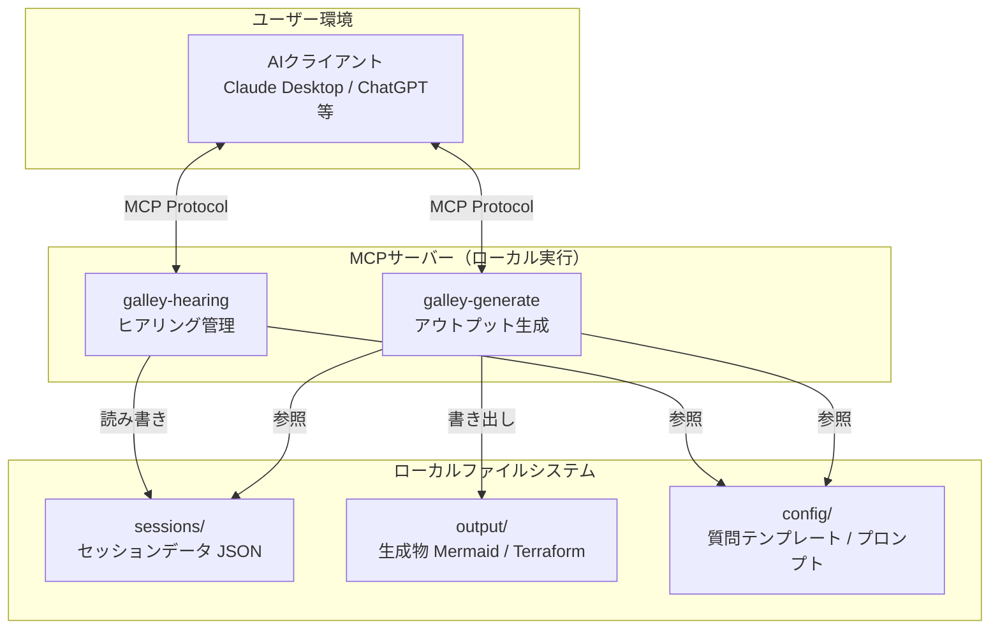
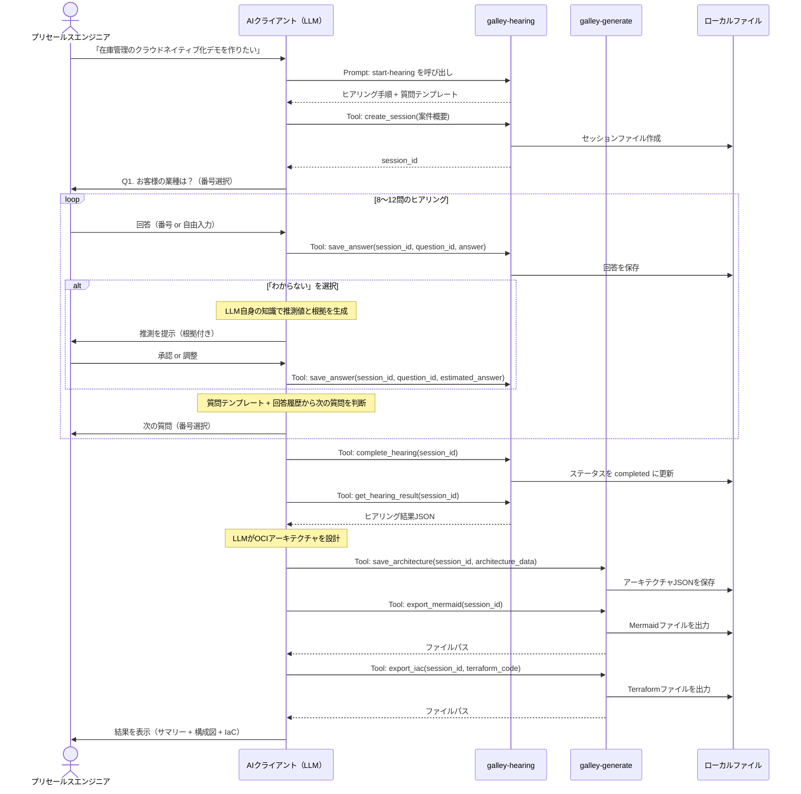
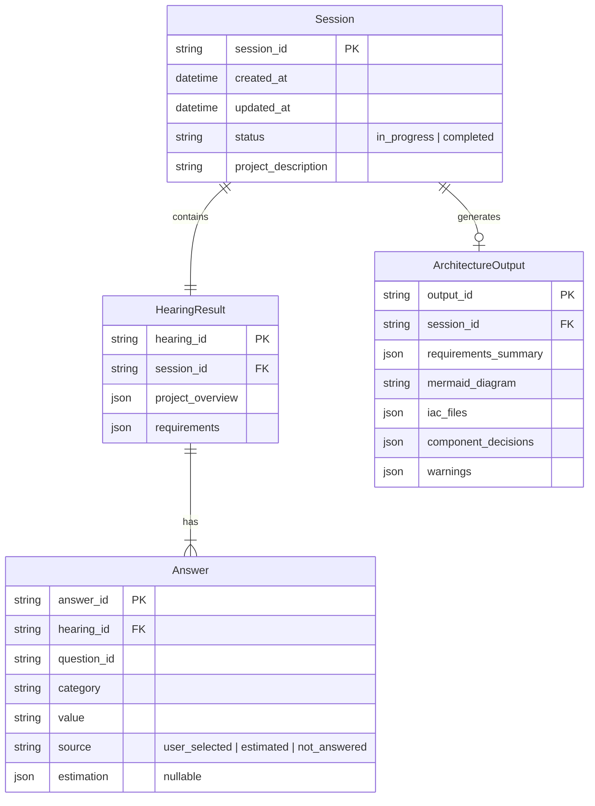

# 機能設計書（Functional Design Document）

## 1. システム全体構成

### 1.1 MVP段階のシステム構成図



### 1.2 MCPの3プリミティブの活用

| プリミティブ | 役割 | 具体例 |
|------------|------|--------|
| **Resources** | AIクライアントにコンテキストを提供する読み取り専用データ | 質問テンプレート、OCIサービスカタログ、リファレンスアーキテクチャ |
| **Tools** | AIクライアントが呼び出すアクション | セッション作成・保存・読み込み、ファイル出力 |
| **Prompts** | 再利用可能なプロンプトテンプレート | ヒアリング開始プロンプト、アーキテクチャ生成プロンプト |

### 1.3 コアフローの全体像



### 1.4 役割分担: AIクライアント vs MCPサーバー

| 責務 | AIクライアント（LLM） | MCPサーバー |
|------|---------------------|------------|
| 質問の生成・判断 | **主担当**: テンプレートを参照しつつ、コンテキストに応じて質問を動的生成 | テンプレートの提供 |
| 推測値の生成 | **主担当**: LLM自身の知識で推測・根拠を生成 | なし（将来: ナレッジストア検索） |
| アーキテクチャ設計 | **主担当**: ヒアリング結果からOCIアーキテクチャを設計 | OCIリファレンスの提供 |
| データ永続化 | なし | **主担当**: セッション・回答・生成物のファイル保存 |
| ファイル出力 | なし | **主担当**: Mermaid・Terraform等のファイル書き出し |
| 会話のナビゲーション | **主担当**: ヒアリングの進行制御 | 進捗管理の補助 |

---

## 2. MCPサーバー設計

### 2.1 galley-hearing サーバー

ヒアリングフローの状態管理とデータ永続化を担当する。

#### Resources

| URI | 説明 |
|-----|------|
| `galley://templates/hearing-questions` | ヒアリング質問カテゴリテンプレート（JSON） |
| `galley://templates/hearing-flow` | ヒアリングフローの進行ルール（分岐条件含む） |
| `galley://schemas/hearing-result` | ヒアリング結果JSONスキーマ |
| `galley://sessions` | 保存済みセッション一覧 |
| `galley://sessions/{session_id}` | 特定セッションの詳細データ |

#### Tools

| ツール名 | 説明 | パラメータ | 戻り値 |
|---------|------|-----------|--------|
| `create_session` | 新規セッションを作成 | `project_description: string` | `session_id: string` |
| `save_answer` | 回答を保存 | `session_id, question_id, category, value, source, estimation?` | 保存結果 |
| `complete_hearing` | ヒアリングを完了にする | `session_id` | ヒアリング結果サマリー |
| `get_hearing_result` | ヒアリング結果を取得 | `session_id` | HearingResult JSON |
| `list_sessions` | セッション一覧を取得 | `status?: string` | セッション一覧 |
| `delete_session` | セッションを削除 | `session_id` | 削除結果 |

#### Prompts

| プロンプト名 | 説明 | 引数 |
|-------------|------|------|
| `start-hearing` | ヒアリングを開始するプロンプト。役割定義・質問テンプレート・進行ルール・出力形式を含む | `project_description: string` |
| `resume-hearing` | 中断したヒアリングを再開するプロンプト | `session_id: string` |

### 2.2 galley-generate サーバー

アーキテクチャ設計結果の保存とファイル出力を担当する。

#### Resources

| URI | 説明 |
|-----|------|
| `galley://references/oci-services` | OCIサービスカタログ（サービス名・用途・制約事項） |
| `galley://references/oci-architectures` | OCIリファレンスアーキテクチャ集 |
| `galley://references/oci-terraform` | OCI Terraform Providerのリソース一覧と使用例 |

#### Tools

| ツール名 | 説明 | パラメータ | 戻り値 |
|---------|------|-----------|--------|
| `save_architecture` | アーキテクチャ設計を保存 | `session_id, components[], decisions[], warnings[]` | 保存結果 |
| `export_summary` | 要件サマリーをMarkdownファイルに出力 | `session_id` | ファイルパス |
| `export_mermaid` | 構成図をMermaidファイルに出力 | `session_id, mermaid_code` | ファイルパス |
| `export_iac` | IaCテンプレートをファイルに出力 | `session_id, files: {name, content}[]` | ファイルパス一覧 |
| `export_all` | 全成果物を一括出力 | `session_id` | 出力ディレクトリパス |

#### Prompts

| プロンプト名 | 説明 | 引数 |
|-------------|------|------|
| `generate-architecture` | ヒアリング結果からOCIアーキテクチャを生成するプロンプト | `session_id: string` |

---

## 3. データモデル定義

### 3.1 ヒアリング結果JSONスキーマ

このスキーマはシステム全体の基盤であり、アーキテクチャ生成・IaC生成・将来のナレッジ蓄積すべてがこのデータ構造に依存する。

```json
{
  "$schema": "http://json-schema.org/draft-07/schema#",
  "title": "HearingResult",
  "description": "ヒアリング結果の構造化データ",
  "type": "object",
  "required": ["metadata", "project_overview", "requirements"],
  "properties": {
    "metadata": {
      "type": "object",
      "required": ["hearing_id", "created_at", "version"],
      "properties": {
        "hearing_id": { "type": "string", "format": "uuid" },
        "created_at": { "type": "string", "format": "date-time" },
        "updated_at": { "type": "string", "format": "date-time" },
        "version": { "type": "string", "const": "1.0.0" },
        "status": {
          "type": "string",
          "enum": ["in_progress", "completed"]
        }
      }
    },
    "project_overview": {
      "type": "object",
      "required": ["description", "industry", "project_type"],
      "properties": {
        "description": {
          "type": "string",
          "description": "ユーザーが入力した案件概要の自然言語テキスト"
        },
        "industry": {
          "$ref": "#/definitions/answered_item",
          "description": "業種"
        },
        "project_type": {
          "$ref": "#/definitions/answered_item",
          "description": "案件種別"
        }
      }
    },
    "requirements": {
      "type": "object",
      "properties": {
        "scale": {
          "type": "object",
          "properties": {
            "concurrent_users": { "$ref": "#/definitions/answered_item" },
            "total_users": { "$ref": "#/definitions/answered_item" }
          }
        },
        "traffic": {
          "type": "object",
          "properties": {
            "spike_pattern": { "$ref": "#/definitions/answered_item" },
            "peak_tps": { "$ref": "#/definitions/answered_item" }
          }
        },
        "database": {
          "type": "object",
          "properties": {
            "existing_db": { "$ref": "#/definitions/answered_item" },
            "migration_required": { "$ref": "#/definitions/answered_item" },
            "data_volume": { "$ref": "#/definitions/answered_item" }
          }
        },
        "network": {
          "type": "object",
          "properties": {
            "multi_region": { "$ref": "#/definitions/answered_item" },
            "on_premises_connection": { "$ref": "#/definitions/answered_item" }
          }
        },
        "security": {
          "type": "object",
          "properties": {
            "auth_method": { "$ref": "#/definitions/answered_item" },
            "compliance": { "$ref": "#/definitions/answered_item" }
          }
        },
        "availability": {
          "type": "object",
          "properties": {
            "sla_target": { "$ref": "#/definitions/answered_item" },
            "dr_requirement": { "$ref": "#/definitions/answered_item" },
            "backup_policy": { "$ref": "#/definitions/answered_item" }
          }
        },
        "performance": {
          "type": "object",
          "properties": {
            "latency_requirement": { "$ref": "#/definitions/answered_item" },
            "throughput_requirement": { "$ref": "#/definitions/answered_item" }
          }
        },
        "operations": {
          "type": "object",
          "properties": {
            "monitoring": { "$ref": "#/definitions/answered_item" },
            "log_retention": { "$ref": "#/definitions/answered_item" }
          }
        },
        "budget_schedule": {
          "type": "object",
          "properties": {
            "cost_constraint": { "$ref": "#/definitions/answered_item" },
            "demo_deadline": { "$ref": "#/definitions/answered_item" }
          }
        }
      }
    }
  },
  "definitions": {
    "answered_item": {
      "type": "object",
      "required": ["value", "source"],
      "properties": {
        "value": {
          "description": "回答の値（選択値 or 自由入力テキスト）"
        },
        "source": {
          "type": "string",
          "enum": ["user_selected", "user_free_text", "estimated", "not_answered"],
          "description": "値の出所"
        },
        "estimation": {
          "type": "object",
          "description": "source が estimated の場合のみ",
          "properties": {
            "confidence_label": {
              "type": "string",
              "enum": ["public_reference", "general_estimate"],
              "description": "MVP段階の信頼度ラベル。チーム展開時に internal_record を追加"
            },
            "reasoning": {
              "type": "string",
              "description": "推測の根拠説明"
            },
            "source_info": {
              "type": "string",
              "description": "参照元の情報（URLや公開事例の説明等）"
            }
          }
        }
      }
    }
  }
}
```

### 3.2 セッションデータモデル



### 3.3 ローカルファイルシステム構造

```
~/.galley/                          ... Galleyのデータディレクトリ
  config/
    hearing-questions.yaml          ... 質問カテゴリテンプレート
    hearing-flow.yaml               ... ヒアリングフロー進行ルール
    oci-services.yaml               ... OCIサービスカタログ
  sessions/
    {session_id}/
      session.json                  ... セッションメタデータ
      hearing-result.json           ... ヒアリング結果
      architecture.json             ... アーキテクチャ設計結果
  output/
    {session_id}/
      summary.md                    ... 要件サマリー
      architecture.mmd              ... 構成図（Mermaid）
      terraform/
        main.tf                     ... メインテンプレート
        variables.tf                ... 変数定義
        outputs.tf                  ... アウトプット定義
```

---

## 4. Prompt設計

### 4.1 start-hearing プロンプト

ヒアリング開始時にAIクライアントに渡されるプロンプト。AIクライアント（LLM）の振る舞いを定義する。

```markdown
# Galley ヒアリングアシスタント

あなたはOCIのプリセールスエンジニア向けヒアリングアシスタントです。
ユーザーから案件の概要を受け取り、選択式の質問を通じて要件を具体化してください。

## 進行ルール

1. 質問テンプレート（Resources: galley://templates/hearing-questions）を参照し、
   カテゴリ順に質問を進めてください
2. 各質問は番号付き選択肢で提示してください。最後の選択肢は必ず「わからない」にしてください
3. 選択肢はユーザーの案件概要と前の回答に応じて動的に調整してください
4. 「わからない」が選ばれた場合:
   - あなた自身の知識から推測値と根拠を提示してください
   - 根拠には信頼度ラベル（📄 公開事例 / 💡 一般推計）を付けてください
   - 根拠が見つからない場合は正直にその旨を伝えてください
   - ユーザーに「この仮定で進めるか」確認してください
5. 各回答は save_answer ツールで必ず保存してください
6. 全質問完了後、complete_hearing ツールを呼んでください

## 出力例（質問）

Q3. セール時など急激なスパイクはありますか？
  1. はい、予測可能なタイミングで
  2. はい、予測不可能
  3. いいえ
  4. わからない

番号で回答してください。自由記述も可能です。

## 案件概要

{{project_description}}
```

### 4.2 generate-architecture プロンプト

アーキテクチャ生成時にAIクライアントに渡されるプロンプト。

```markdown
# Galley アーキテクチャジェネレーター

ヒアリング結果に基づいて、OCIのアーキテクチャを設計してください。

## 設計ルール

1. OCIサービスカタログ（Resources: galley://references/oci-services）を参照し、
   適切なサービスを選定してください
2. 各コンポーネントの選定理由を明記してください
3. 以下のカテゴリで構成してください:
   - コンピュート、データベース、ネットワーク、セキュリティ・認証、
     ストレージ、監視・運用
4. アンチパターンを検出した場合は警告してください:
   - 単一障害点、セキュリティグループの全開放、バックアップ未設定 等
5. 設計結果は save_architecture ツールで保存してください

## 出力形式

### 1. 要件サマリー
確定事項（✅）、推測に基づく仮定（🔶）、未確認（⚠️）の3区分で整理

### 2. アーキテクチャ概要
各コンポーネントの選定理由を表形式で

### 3. 構成図
Mermaid記法で出力 → export_mermaid ツールでファイル保存

### 4. IaCテンプレート
Terraform（OCI Provider）形式 → export_iac ツールでファイル保存

### 5. 警告・推奨事項
アンチパターンや未確認項目に基づく注意点
```

---

## 5. エラーハンドリング

### 5.1 エラー分類と対応

| エラー種別 | 発生箇所 | 対応 |
|-----------|---------|------|
| セッションが見つからない | galley-hearing | エラーメッセージを返す。AIクライアントがユーザーに伝える |
| ファイル書き込み失敗 | 両サーバー | エラーメッセージを返す。ディスク容量・権限の確認を促す |
| JSONバリデーションエラー | galley-hearing | 不正なフィールドを示すエラーメッセージを返す |
| セッションディレクトリ容量超過 | 両サーバー | 古いセッションの削除を促すメッセージを返す |

### 5.2 MCPサーバーの設計方針

- MCPサーバーはデータ層に徹し、エラーは呼び出し元（AIクライアント）に返す
- AIクライアント（LLM）がエラーメッセージをユーザーに適切に伝達する
- ファイルI/Oのエラーは具体的な原因（パーミッション、ディスク容量等）を含める
